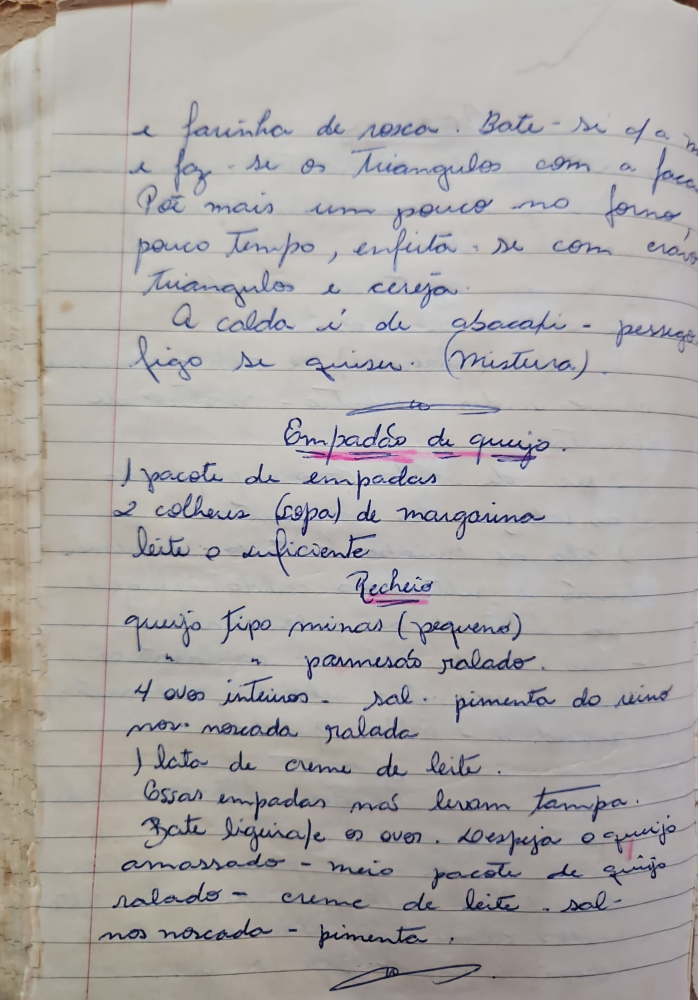

# Página 45
:::danger[NÃO REVISADO]
A página não foi revisada, portanto pode conter erros de digitação, formatação ou alucinações.
:::
e farinha de rosca. Bate-se a m
e faz-se os Triangulos com a face
Por mais um pouco no forno
pouco tempo, enfeita-se com cravo
Triangulos e cereja.
A calda é de abacati - pessego
figo se quiser. (Mistura).

## Empadão de queijo

- 1 pacote de empadas
- 2 colheres (sopa) de margarina
- leite o suficiente

### Recheio

- queijo tipo minas (pequeno)
- parmesão ralado.
- 4 ovos inteiros - sal - pimenta do reino
- nos moscada ralada
- 1 lata de creme de leite.

Essas empadas não levam tampa.
Bate ligeirafe os ovos. Despeja o queijo
amassado - meio pacote de queijo
ralado - creme de leite - sal -
nos moscada - pimenta.

