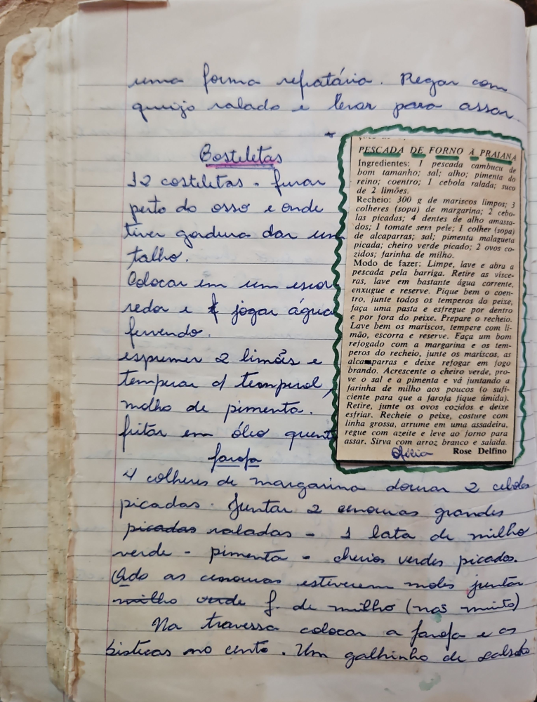

# Página 47
:::danger[NÃO REVISADO]
A página não foi revisada, portanto pode conter erros de digitação, formatação ou alucinações.
:::
uma forma refratária. Regar com
queijo ralado e levar para assar

## Costeletas

1. 12 costeletas. Furar perto do osso e onde tiver gordura dar um talho.
2. Colocar em um escorredor e jogar água fervendo.
3. Espremer 2 limões e temperar com tempero e molho de pimenta.
4. Fritar em óleo quente.

### Farofa

5. Em 4 colheres de margarina, dourar 2 cebolas picadas.
6. Juntar 2 cenouras grandes picadas raladas.
7. Juntar 1 lata de milho verde.
8. Adicionar pimenta e cheiros verdes picados.
9. Quando as cenouras estiverem moles, juntar milho verde e farinha de milho (não muito).
10. Na travessa, colocar a farofa e as bistecas no centro.
11. Um galhinho de salsinha.

## Pescada de Forno à Praiana

### Ingredientes:
- 1 pescada cambucu de bom tamanho
- sal
- alho
- pimenta do reino
- coentro
- 1 cebola ralada
- suco de 2 limões.

### Recheio:
- 300 g de mariscos limpos
- 3 colheres (sopa) de margarina
- 2 cebolas picadas
- 4 dentes de alho amassados
- 1 tomate sem pele
- 1 colher (sopa) de alcaparras
- sal
- pimenta malagueta picada
- cheiro verde picado
- 2 ovos cozidos
- farinha de milho.

### Modo de fazer:
1. Limpe, lave e abra a pescada pela barriga. Retire as vísceras, lave em bastante água corrente, enxugue e reserve.
2. Pique bem o coentro, junte todos os temperos do peixe, faça uma pasta e esfregue por dentro e por fora do peixe.
3. Prepare o recheio. Lave bem os mariscos, tempere com limão, escorra e reserve.
4. Faça um bom refogado com a margarina e os temperos do recheio, junte os mariscos, as alcaparras e deixe refogar em fogo brando.
5. Acrescente o cheiro verde, prove o sal e a pimenta e vá juntando a farinha de milho aos poucos (o suficiente para que a farofa fique úmida).
6. Retire, junte os ovos cozidos e deixe esfriar.
7. Recheie o peixe, costure com linha grossa, arrume em uma assadeira, regue com azeite e leve ao forno para assar.
8. Sirva com arroz branco e salada.

Odília Rose Delfino

