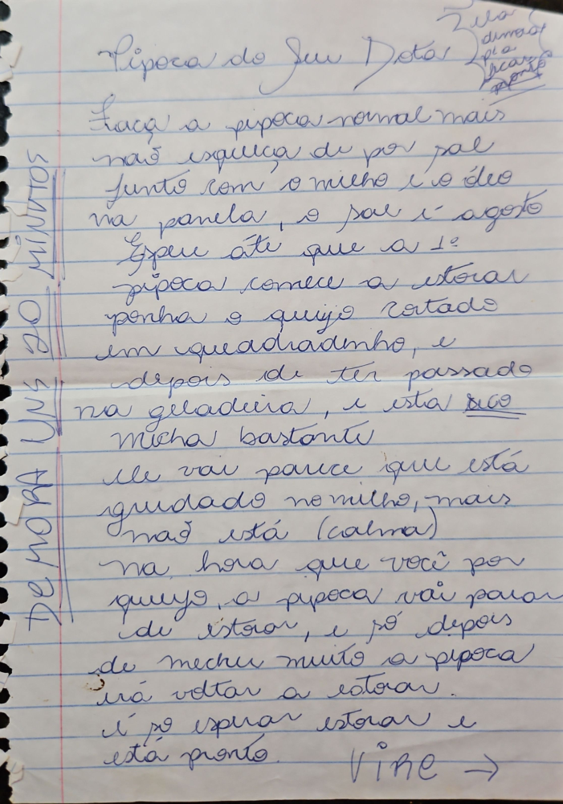

# Página 48
:::danger[NÃO REVISADO]
A página não foi revisada, portanto pode conter erros de digitação, formatação ou alucinações.
:::
## Pipoca do Seu Juv.

*Nota de Tempo: 20 MINUTOS 2 HORA*

*Outras notas: Zila, dumast, Ola?, DeCarp, ponts*

1.  Faça a pipoca normal mais não esqueça de por sal
2.  junto com o milho e o óleo na panela, o sal é a gosto
3.  Espere até que a 1ª pipoca comece a estourar
4.  ponha o queijo cortado em quadradinho, e depois de ter passado na geladeira, e está seco
5.  Mexa bastante
6.  Ele vai parece que está grudado no milho, mais não está (calma)
7.  na hora que você por queijo, a pipoca vai parar de estourar, e só depois de mecher muito a pipoca irá voltar a estourar.
8.  é só esperar estourar e está pronto.

VIRE ->

