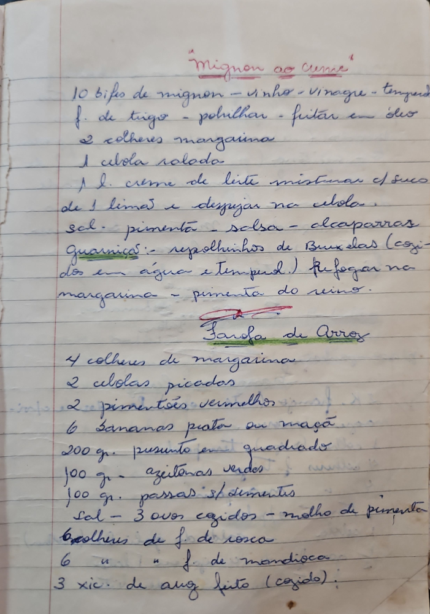

# Página 50
:::danger[NÃO REVISADO]
A página não foi revisada, portanto pode conter erros de digitação, formatação ou alucinações.
:::
## Mignon ao Currie
- 10 bifes de mignon - vinho - vinagre - tempêro
- f. de trigo - polvilhar - fritar em óleo
- 2 colheres margarina
- 1 cebola ralada
- 1 l. creme de leite misturar c/ suco
- de 1 limão e despejar na cebola
- sal - pimenta - salsa - alcaparras
- Guarnições: - repolhinhos de Bruxelas (cozi-
- dos em água e tempêro.) Refogar na
- margarina - pimenta do reino.

## Farofa de Arroz
- 4 colheres de margarina
- 2 cebolas picadas
- 2 pimentões vermelhos
- 6 bananas prata ou maçã
- 200 gr. presunto em quadrado
- 100 gr - azeitonas verdes
- 100 gr. passas s/ sementes
- Sal - 3 ovos cozidos - molho de pimenta
- 6 colheres de f. de rosca
- 6 " " f. de mandioca
- 3 xic. de arroz feito (cozido).

