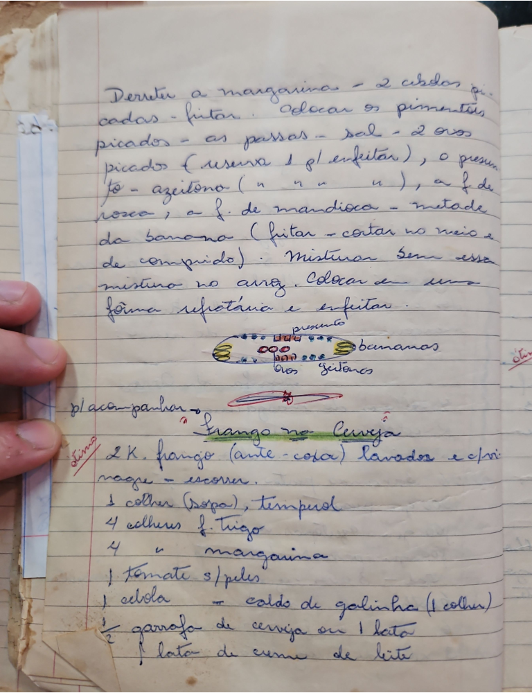

# Página 51
:::danger[NÃO REVISADO]
A página não foi revisada, portanto pode conter erros de digitação, formatação ou alucinações.
:::
## Derreter a margarina

Derreter a margarina - 2 cebolas picadas - fritar. Colocar os pimentões picados - as passas - sal - 2 ovos picados (reserva 1 pl. enfeitar), o presunto - azeitona (preta e verde), a f. de rosca, a f. de mandioca - metade da banana (fritar - cortar no meio e de comprido). Misturar bem essa mistura no arroz. Colocar em uma fôrma refratária e enfeitar.

### Presente

- presunto
- bananas
- ovos cozidos

## Frango no Cerveja

### Ingredientes

- 2 K. frango (ante - coxa) lavados e escorrer.
- 1 colher (sopa) tempurá
- 4 colheres f. trigo
- 4 " margarina
- 1 Tomate s/peles
- 1 cebola
- caldo de galinha (1 colher)
- ½ garrafa de cerveja ou 1 lata
- 1 lata de creme de leite

