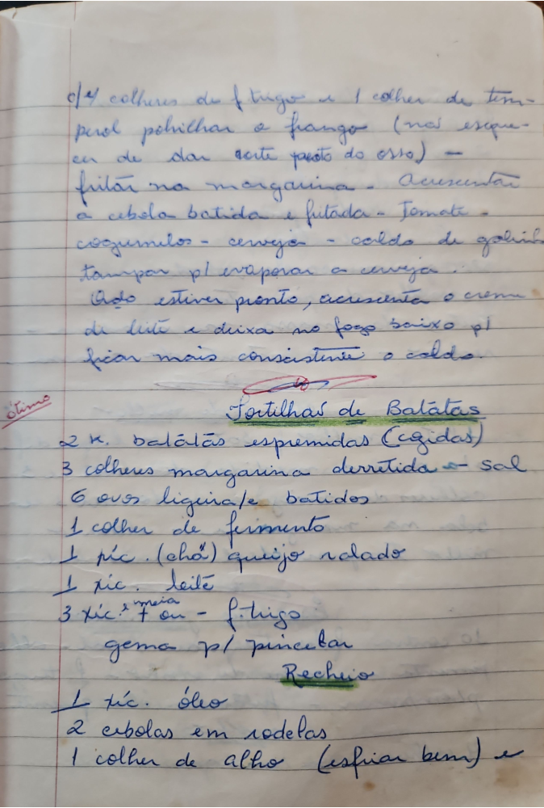

# Página 52
:::danger[NÃO REVISADO]
A página não foi revisada, portanto pode conter erros de digitação, formatação ou alucinações.
:::
## [Receita Indefinida]
- c/4 colheres de trigo e 1 colher de tempero, polvilhar o frango (não esquecer de dar corte perto do osso) -
- fritar na margarina -
- Acrescentar a cebola batida e fritaida - Tomate - cogumelos - cerveja - caldo de galinha
- tampar pl/ evaporar a cerveja -
- Quando estiver pronto, acrescenta o creme de leite e deixa no fogo baixo pl/ ficar mais consistente o caldo.

## Tortilhas de Batatas
(ótimo)

### Ingredientes
- 2 K. batatas espremidas (cozidas)
- 3 colheres margarina derretida - sal
- 6 ovos ligeirafte batidos
- 1 colher de fermento
- 1 xic. (chá) queijo ralado
- 1 xic. leite
- 3 xic. e ¹/² - f. trigo
- gema pl/ pincelar

### Recheio
- 1 xic. óleo
- 2 cebolas em rodelas
- 1 colher de alho (esfriar bem) e

