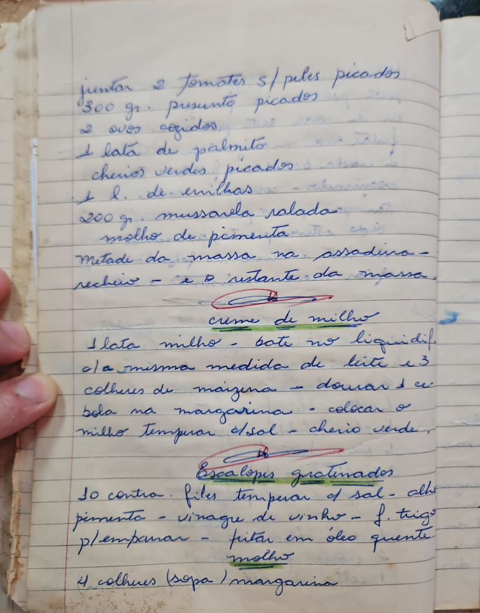

# Página 53
:::danger[NÃO REVISADO]
A página não foi revisada, portanto pode conter erros de digitação, formatação ou alucinações.
:::
Aqui está o texto extraído da imagem, formatado em Markdown:

- juntar 2 tomates s/ peles picados
- 300 gr. presunto picados
- 2 ovos cozidos
- 1 lata de palmito
- cheiros verdes picados
- 1 l. de ervilhas
- 200 gr. mussarela ralada
- molho de pimenta
- Metade da massa na assadeira - recheio - e o restante da massa

### Creme de Milho

- 1 lata milho - bate no liquidif.
- ola mesma medida de leite e 3 colheres de maizena
- dourar c. bola na margarina
- colocar o milho
- temperar sal - cheiro verde.

### Escalopes Gratinados

- 10 contra-files
- temperar sal - alho - pimenta - vinagre de vinho
- p/ empanar - f. trigo
- fritar em óleo quente

### Molho

- 4 colheres (sopa) margarina

