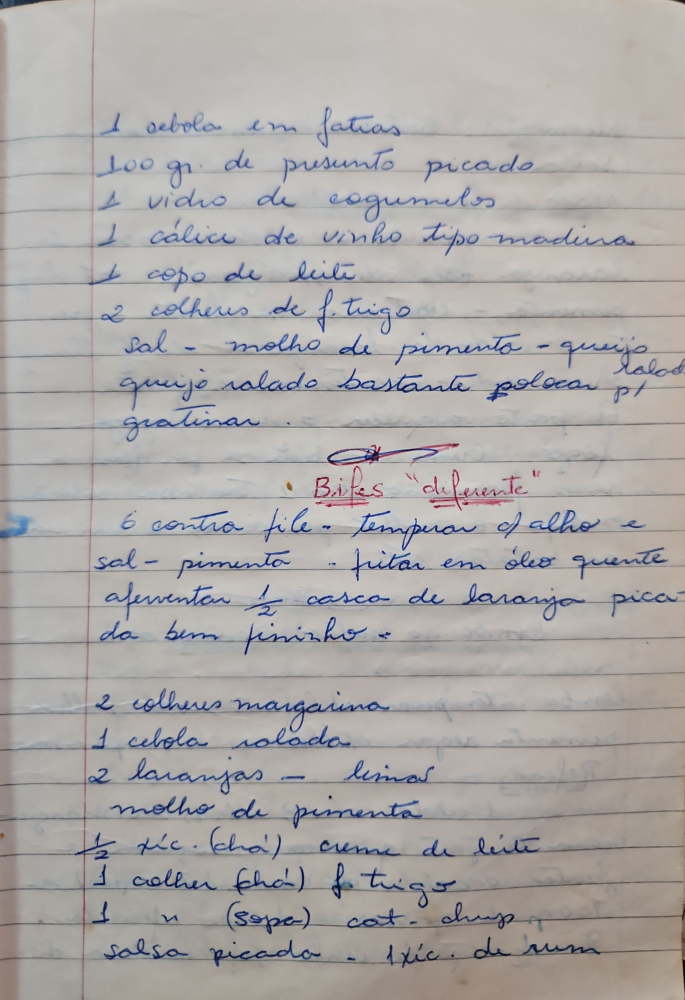

# Página 54
:::danger[NÃO REVISADO]
A página não foi revisada, portanto pode conter erros de digitação, formatação ou alucinações.
:::
- 1 cebola em fatias
- 100 gr. de presunto picado
- 1 vidro de cogumelos
- 1 cálice de vinho tipo madeira
- 1 copo de leite
- 2 colheres de f. trigo
- sal - molho de pimenta - queijo ralado bastante colocar p/ gratinar.

## Bifes "diferente"

- 6 contra file - temperar c/ alho e sal - pimenta - fritar em óleo quente
- aferventar 1/2 casca de laranja picada bem fininho -
- 2 colheres margarina
- 1 cebola ralada
- 2 laranjas - limão
- molho de pimenta
- 1/2 xc. (chá) creme de leite
- 1 colher (chá) f trigo
- 1 " (sopa) cat. chups
- salsa picada - 1 xc. de rum

