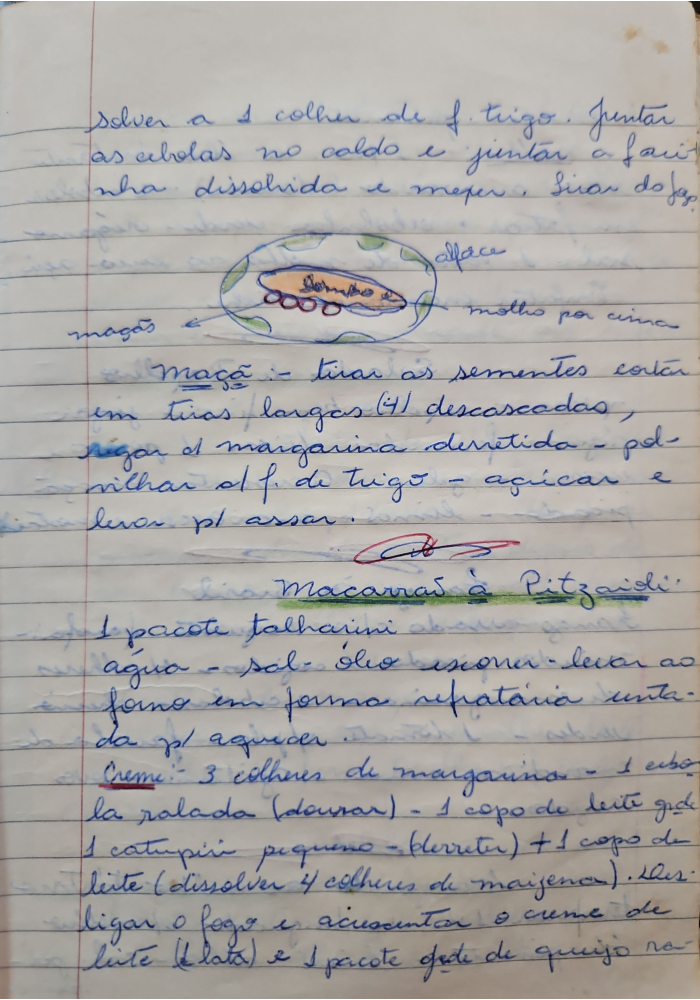

# Página 56
:::danger[NÃO REVISADO]
A página não foi revisada, portanto pode conter erros de digitação, formatação ou alucinações.
:::

## Solver a 1 colher

Solver a 1 colher de f. trigo. Juntar as cebolas no caldo e juntar a farinha dissolvida e meper. Tirar do fogo.

(Desenho com anotações: maças, alface, molho por cima)

## Maça

Maça:
- tirar as sementes
- cortar em tiras largas (4) descascadas, regar c/ margarina derretida
- polvilhar c/ f. de trigo
- açicar e levar p/ assar.

## Macarrão à Pitzardi

- 1 pacote talharini
- agua
- sal
- oleo
- escorrer
- levar ao forno em forma refratária untada p/ aquecer

### Creme:

- 3 colheres de margarina
- 1 cubo
- la ralada (dourar)
- 1 copo de leite gel
- 1 catupiry pequeno - (derreter)
- + 1 copo de leite (dissolver 4 colheres de maizena).
- Desligar o fogo e acrescentar o creme de leite (1 lata) e 1 pacote de queijo ro...

