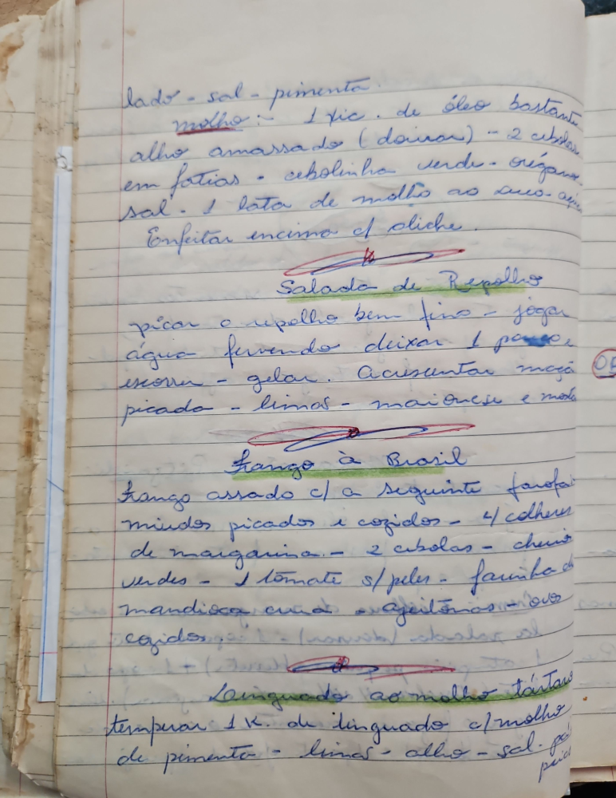

# Página 57
:::danger[NÃO REVISADO]
A página não foi revisada, portanto pode conter erros de digitação, formatação ou alucinações.
:::
## Receitas

### Parte 1 (possivelmente continuação de outra receita)

- lado - sal - pimenta
- molho:
    - 1 tic. de óleo bastante
    - alho amassado (dois ros)
    - 2 cebolas em fatias
    - cebolinha verde
    - crispas
    - sal
    - 1 lata de molho ao suco. água
- Enfeitar encima cf diche.

### Salada de Repolho

- picar o repolho bem fino
- jogar água fervendo
- deixar 1 passo
- escorrer
- gelar.
- Acrescentar
    - maçã picada
    - limas
    - maionese e molho

### Frango à Brasil

- Frango assado c/ a seguinte farofa:
    - miúdos picados e cozidos
    - 4 colheres de margarina
    - 2 cebolas - chuis verdes
    - 1 tomate s/ peles
    - farinha de mandioca crua
    - azeitonas
    - ovos cozidos

### Linguado ao molho tártaro

- temperar 1 k. de linguado c/ molho de pimenta
- limas
- alho
- sal
- pepino picado

