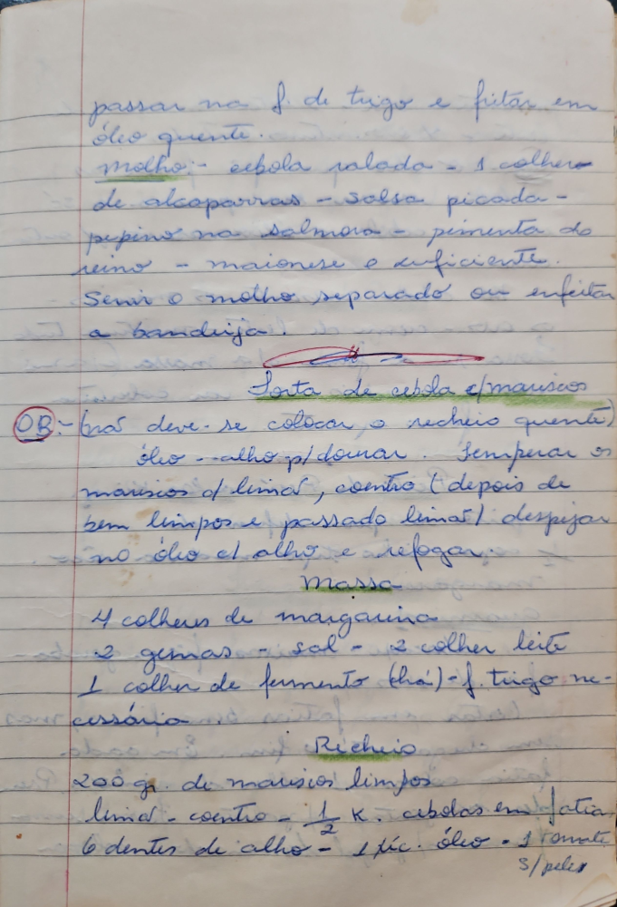

# Página 58
:::danger[NÃO REVISADO]
A página não foi revisada, portanto pode conter erros de digitação, formatação ou alucinações.
:::
passar na f. de trigo e fritar em óleo quente.

### Molho
- cebola ralada
- 1 colher de alcaparras
- salsa picada
- pepino na salmora
- pimenta do reino
- maionese e suficiente

Servir o molho separado ou enfeitar a bandija.

## Torta de cebola c/ mariscos

(OB: - mas deve-se colocar o recheio quente)

### Preparo dos Mariscos
- óleo - alho p/ dourar.
- Temperar os mariscos c/ limão, coentro (depois de bem limpos e passado limão)
- despejar no óleo c/ alho e refogar.

### Massa
- 4 colheres de margarina
- 2 gemas
- sal
- 2 colher leite
- 1 colher de fermento (chá)
- f. trigo necessário

### Recheio
- 200 gr. de mariscos limpos
- limão
- coentro
- 1/2 K. cebolas em fatia
- 6 dentes de alho
- 1 pic. óleo
- 1 tomate s/ pele

