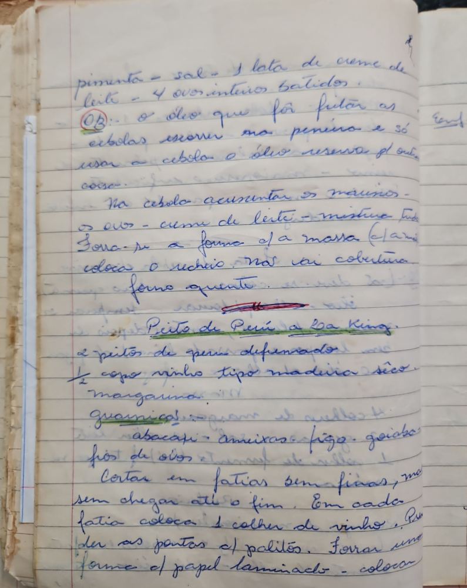

# Página 59
:::danger[NÃO REVISADO]
A página não foi revisada, portanto pode conter erros de digitação, formatação ou alucinações.
:::

pimenta - sal - 1 lata de creme de
leite - 4 ovos inteiros batidos.
Obs: o óleo que fôr fritar as
cebolas escorrer na peneira e só
usar a cebola. o óleo reserva p/ outa
coisa.

Na cebola acrescentar os miúdos -
os ovos - creme de leite - misturar tudo.
Por-se a fôrma c/ a massa (clara)
coloca o recheio. Não vai cobertura.
Vai ao fôrno quente.

## Peito de Perú a la King

*   2 peitos de peru desfiados
*   ½ copo vinho tipo madeira sêco
*   margarina

### Guarnições:

*   abacaxi
*   ameixas
*   figo
*   goiaba
*   fios de ovos

*   Cortar em fatias sem finas, mas sem chegar até o fim.
*   Em cada fatia coloca 1 colher de vinho.
*   Prender as pontas c/ palitos.
*   Forrar uma fôrma c/ papel laminado - colocar

