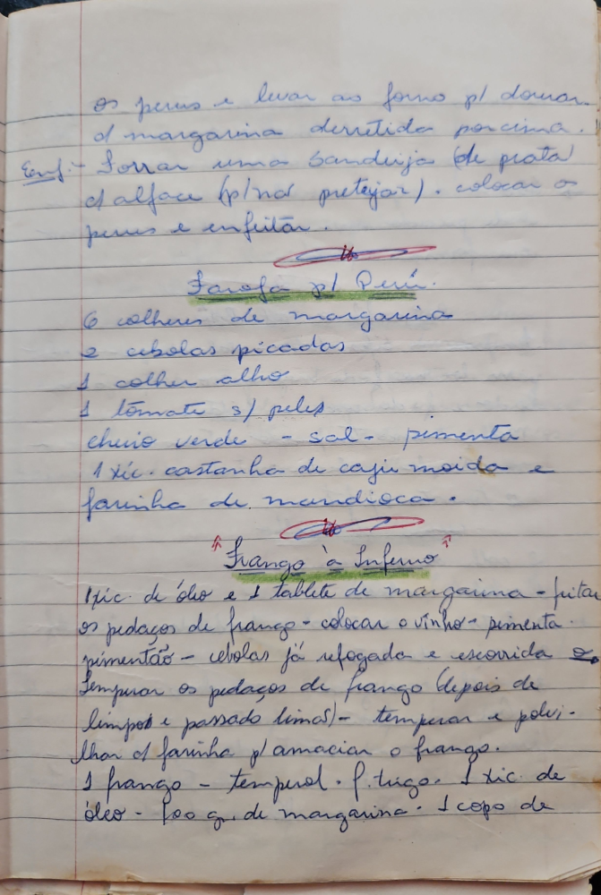

# Página 60
:::danger[NÃO REVISADO]
A página não foi revisada, portanto pode conter erros de digitação, formatação ou alucinações.
:::
- os perus e levar ao forno p/ dourar
- d' margarina derretida por cima.
- Enf. Forrar uma bandeja (de prata
- d' alface p/ não pretejar). colocar os
- perus e enfeitar.

## Farofa pl Peru

- 6 colheres de margarina
- 2 cebolas picadas
- 1 colher alho
- 1 tomate s/ peles
- cheiro verde - sal - pimenta
- 1 xic. castanha de caju moída e
- farinha de mandioca.

## Frango à Inferno

- 1 xic. de óleo e 1 tablete de margarina - fritar
- os pedaços de frango - colocar o vinho - pimenta -
- pimentão - cebolas já refogada e escorrida so
- Temperar os pedaços de frango (depois de
- limpos e passado limas) - temperar e polvi-
- lhar a farinha p/ amacian o frango.
- 1 frango - temperal. P. trigo. 1 xic. de
- óleo - 100 gr. de margarina. 1 copo de

