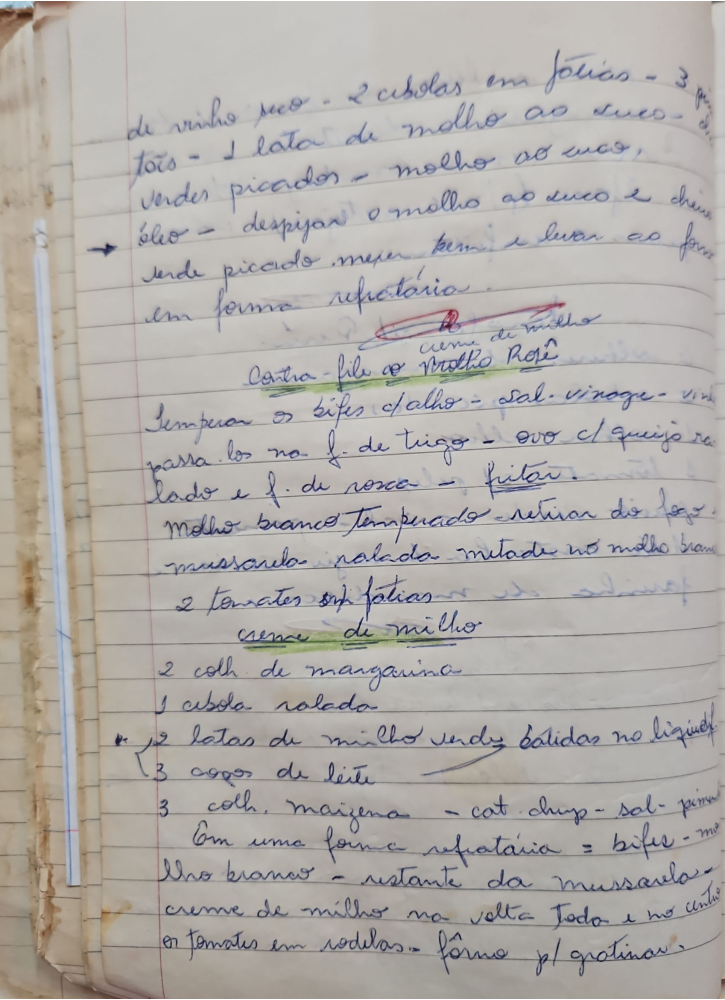

# Página 61
:::danger[NÃO REVISADO]
A página não foi revisada, portanto pode conter erros de digitação, formatação ou alucinações.
:::
de vinho seco - 2 cebolas em fatias - 3 [ilegível] - 1 lata de molho ao suco -
Verdes picados - molho ao suco,
óleo - despejar o molho ao suco e cheiros
verde picado mexer bem e levar ao forno
em forma refrataria.
(cum de milho) - *this line with red pen seems like a note or correction*

## Contra filé ao Molho Rosê

Temperar os bifes c/alho - Sal, vinagre - vinho
passa-los na f. de trigo - ovo c/ queijo ralado
ralado e f. de rosca - fritar.
Molho branco Temperado - retirar do fogo.
Mussarela ralada - metade no molho branco.
2 tomates emp fatias

### creme de milho

- 2 colh. de margarina
- 1 cebola ralada
- 2 latas de milho verde batidas no liquidif
- 3 copos de leite
- 3 colh. maizena - cat. chup - sal - pimen[ta]

Em uma forma refrataria = bifes - molho branco - restante da mussarela - creme de milho na volta toda e no centro os tomates em rodelas - forno p/ gratinar.

