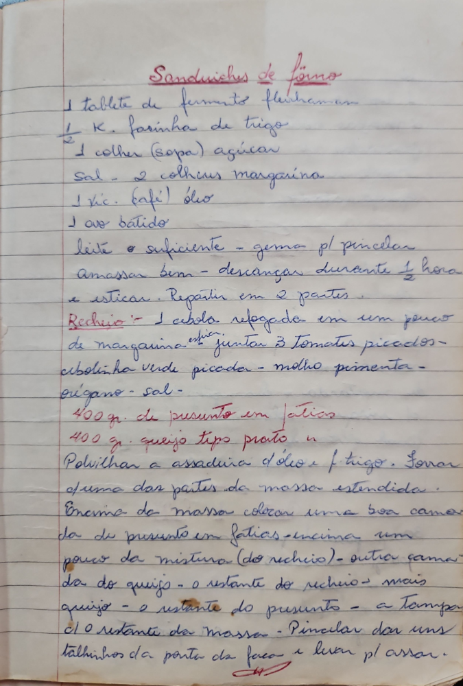

# Página 62
:::danger[NÃO REVISADO]
A página não foi revisada, portanto pode conter erros de digitação, formatação ou alucinações.
:::
## Sanduíches de forno

- 1 tablete de fermento fleishmann
- ½ K. farinha de trigo
- 1 colher (sopa) açúcar
- Sal - 2 colheres margarina
- 1 xic. (café) óleo
- 1 ovo batido

leite o suficiente - gema pl pincelar

Amassar bem - descançar durante ½ hora
e esticar. Repartir em 2 partes.

### Recheio

1 cebola refogada em um pouco
de margarina escor. juntar 3 tomates picados -
cebolinha verde picada - molho pimenta -
orégano - sal -

- 400 gr. de presunto em fatias
- 400 gr. queijo tipo prato.

Polvilhar a assadeira c'óleo e f trigo. Forrar
uma das partes da massa estendida.
Emcima da massa colocar uma boa camada
da de presunto em fatias - encima um
pouco da mistura (do recheio) - outra camada
da do queijo - o restante do recheio - mais
queijo - o restante do presunto - a tampar
c'o restante da massa - Pincelar dar uns
talhinhos c'a ponta da faca - e levar pl assar.

