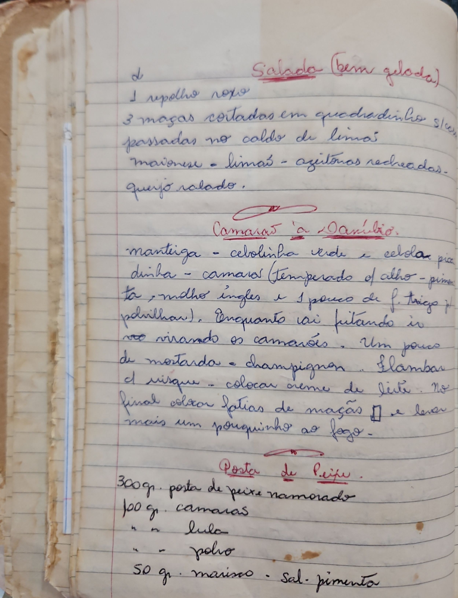

# Página 63
:::danger[NÃO REVISADO]
A página não foi revisada, portanto pode conter erros de digitação, formatação ou alucinações.
:::

## Salada (bem gelada)

-   1 repolho roxo
-   3 maçãs cortadas em quadradinho s/casca
-   passadas no caldo de limão
-   maionese
-   limão
-   azeitonas recheadas
-   queijo ralado.

## Camarão à Danilo

-   manteiga
-   cebolinha verde
-   cebola picadinha
-   camarão (temperado c/alho - pimenta - molho inglês e 1 pouco de f. trigo p/polvilhar).
-   Enquanto vai fritando ir vcs virando os camarões.
-   Um pouco de mostarda
-   champignon
-   flambar c/ visque
-   colocar creme de leite.
-   No final colocar fatias de maçãs e levar mais um pouquinho ao fogo.

## Posta de Peixe

-   300gr. posta de peixe namorado
-   100 gr. camarão
-   " " lula
-   " " polvo
-   50 gr. marisco
-   Sal. pimenta.

