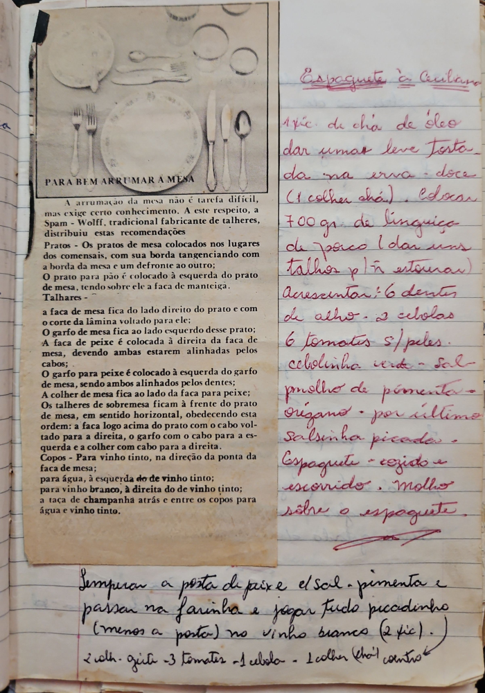

# Página 64
:::danger[NÃO REVISADO]
A página não foi revisada, portanto pode conter erros de digitação, formatação ou alucinações.
:::
## Para Bem Arrumar a Mesa

A arrumação da mesa não é tarefa difícil, mas exige certo conhecimento. A este respeito, a Spam - Wolff, tradicional fabricante de talheres, distribuiu estas recomendações

**Pratos** - Os pratos de mesa colocados nos lugares dos comensais, com sua borda tangenciando com a borda da mesa e um defronte ao outro;
O prato para pão é colocado à esquerda do prato de mesa, tendo sobre ele a faca de manteiga.
**Talheres** -

a faca de mesa fica do lado direito do prato e com o corte da lâmina voltado para ele;
O garfo de mesa fica ao lado esquerdo desse prato;
A faca de peixe é colocada à direita da faca de mesa, devendo ambas estarem alinhadas pelos cabos;

O garfo para peixe é colocado à esquerda do garfo de mesa, sendo ambos alinhados pelos dentes;
A colher de mesa fica ao lado da faca para peixe;
Os talheres de sobremesa ficam à frente do prato de mesa, em sentido horizontal, obedecendo esta ordem: a faca logo acima do prato com o cabo voltado para a direita, o garfo com o cabo para a esquerda e a colher com cabo para a direita.
**Copos** - Para vinho tinto, na direção da ponta da faca de mesa;
para água, à esquerda do de vinho tinto;
para vinho branco, à direita do de vinho tinto;
a taça de champanhã atrás e entre os copos para água e vinho tinto.

## Espaguete à Giuliano

- 1 vic. de chá de óleo
- dar umas leve tosta da na erva doce (1 colher chá)
- colocar 700 gr de linguiça de porco (dar uns talhos p/ ñ estourar)
- Acrescentar: 6 dentes de alho
- 2 cebolas
- 6 tomates s/ peles
- cebolinha verde
- sal
- molho de pimenta
- orégano
- por último salsinha picada
- Espaguete cozido e escorrido. Molho sobre o espaguete.

Temperar a posta de peixe c/ sal, pimenta e passar na farinha e jogar tudo picadinho (menos a posta) no vinho branco (2 vic).
- 2 colh. azeite
- 3 tomates
- 1 cebola
- 1 colher chá coentro

