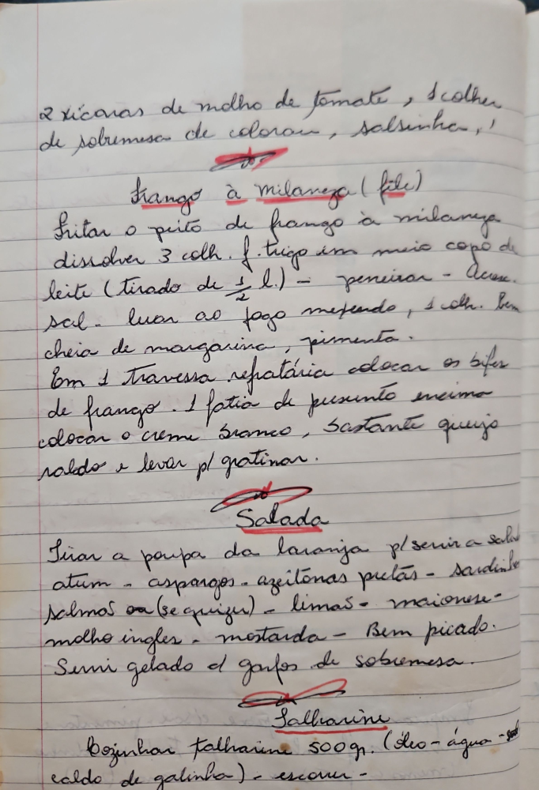

# Página 65
:::danger[NÃO REVISADO]
A página não foi revisada, portanto pode conter erros de digitação, formatação ou alucinações.
:::

## 2 xícaras de molho de tomate, escolher
de sobremesa de colorau, salsinha,-`

### Frango à milaneza (filé)

Fritar o peito de frango à milaneza
dissolver 3 colh. f. trigo em meio copo de
leite (tirado de ½ l.) - peneirar - Acesc.
sal - levar ao fogo mexendo, 1 colh. bem
cheia de margarina, pimenta.
Em 1 travessa refrataria colocar os bifes
de frango - 1 fatia de presunto emcimo
colocar o creme branco, bastante queijo
ralado e levar pl gratinar.

## Salada

Tirar a polpa da laranja pl servir a salada
atum - aspargos - azeitonas pretas - sardinha
Salmão ou (se quizer) - limão - maionese -
molho ingles - mostarda - Bem picado.
Servir gelado c/ garfos de sobremesa.

## Salharim

Cozinhar talharim 500 gr. (Oleo-agua-sal-
caldo de galinha) - escorrer -

