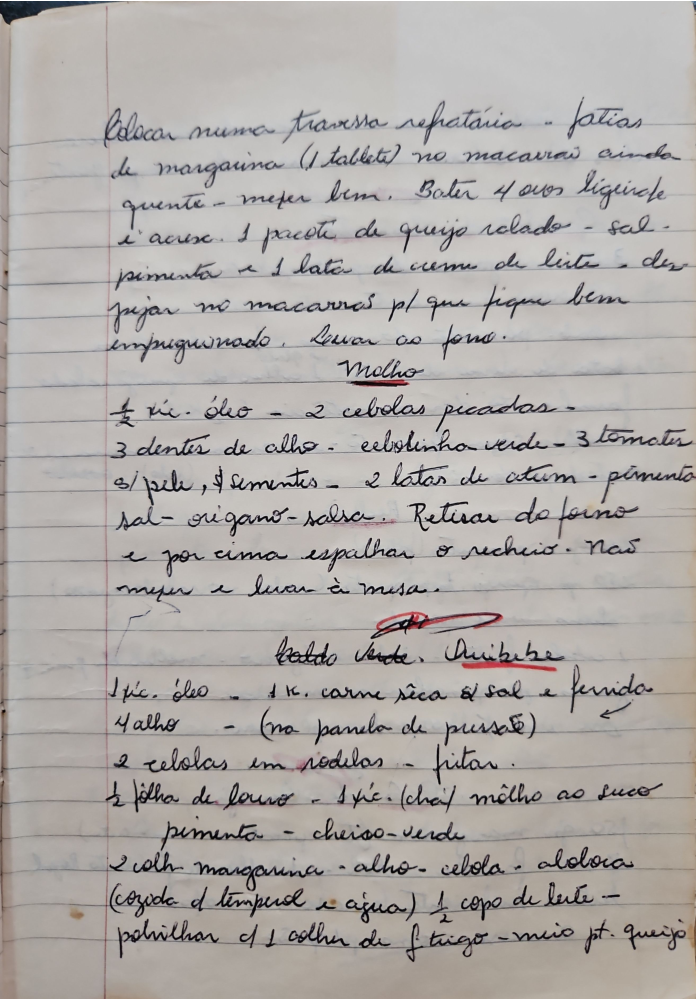

# Página 66
:::danger[NÃO REVISADO]
A página não foi revisada, portanto pode conter erros de digitação, formatação ou alucinações.
:::
Colocar numa travessa refratária - fatias
de margarina (1 tablete) no macarrão ainda
quente - mexer bem. Bater 4 ovos liquidifica
c' acresc. 1 pacote de queijo ralado - sal -
pimenta e 1 lata de creme de leite - despejar no macarrão p/ que fique bem
impregnado. Levar ao forno.

### Molho
- ½ xc. óleo
- 2 cebolas picadas
- 3 dentes de alho
- cebolinha verde
- 3 tomates s/ pele, e sementes
- 2 latas de atum
- pimenta
- sal
- orégano
- salsa.
- Retirar do forno e por cima espalhar o recheio. Não mexer e levar à mesa.

## Baldo Verde
### Quibebe
- ½ xc. óleo
- 1 k. carne seca já sal e fervida (na panela de pressão)
- 4 alho
- 2 cebolas em rodelas - fritar.
- ½ folha de louro
- 1 xc. (chá) milho ao suco
- pimenta
- cheiro-verde
- 2 colh margarina
- alho
- cebola
- abóbora (cozida d temperei e agua)
- ½ copo de leite
- polvilhar c/ 1 colher de farinha de trigo
- meio pacote de queijo

