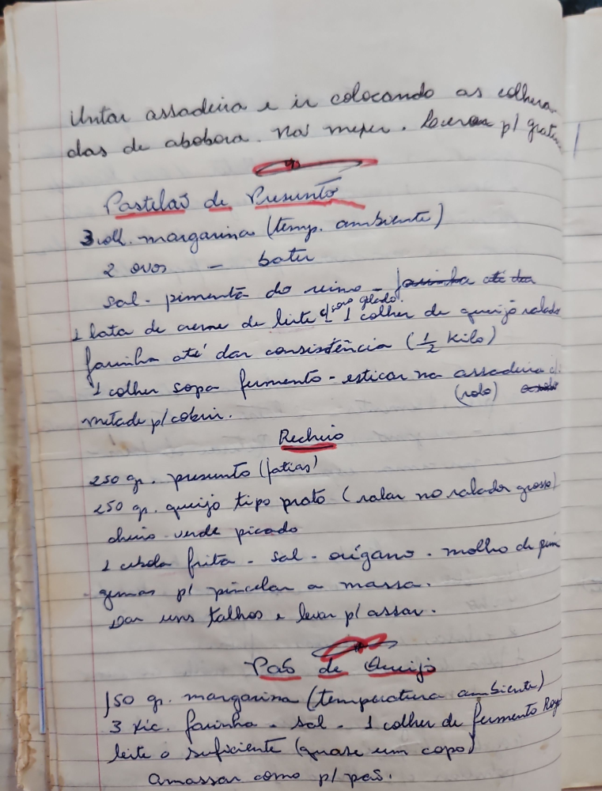

# Página 67
:::danger[NÃO REVISADO]
A página não foi revisada, portanto pode conter erros de digitação, formatação ou alucinações.
:::
Untar assadeira e ir colocando as colheradas de abobora. Não mexer. Levar p/ gratinar.

## Pastelão de Presunto

- 3 colh. margarina (temp. ambiente)
- 2 ovos - bater
- sal - pimenta do reino - pouquinho até dar ponto gelado!
- 1 lata de creme de leite
- 1 colher de queijo ralado
- farinha até dar consistência (½ kilo)
- 1 colher sopa fermento - esticar na assadeira de (rolo)
- metade p/ cobrir.

### Recheio

- 250 gr. presunto (fatias)
- 250 gr. queijo tipo prato (ralar no ralador grosso)
- cheiro-verde picado
- 1 cebola frita - sal - orégano - molho de pimenta
- gemas p/ pincelar a massa.
- Dar uns talhos e levar p/ assar.

## Pão de Queijo

- 150 gr. margarina (temperatura ambiente)
- 3 xic. farinha - sal - 1 colher de fermento Royal
- leite o suficiente (quase um copo)
- Amassar como p/ pão.

