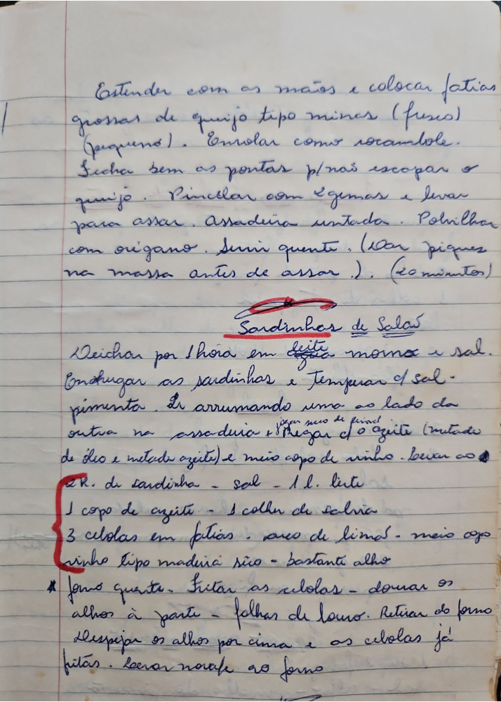

# Página 68
:::danger[NÃO REVISADO]
A página não foi revisada, portanto pode conter erros de digitação, formatação ou alucinações.
:::
Estender com as mãos e colocar fatias grossas de queijo tipo minas (fresco) (pequeno). Enrolar como rocambole.
Fecha bem as pontas para não escapar o queijo. Pincelar com 2 gemas e levar para assar. Assadeira untada. Polvilhar com orégano. Servir quente. (Dar piques na massa antes de assar). (20 minutos)

## Sardinhas de Salão

Deixar por 1 hora em leite morno e sal.
Enxugar as sardinhas e temperar com sal, pimenta.
Ir arrumando uma ao lado da outra na assadeira.
Pegar com o azeite (metade de óleo e metade azeite) e meio copo de vinho. (pegar meio de pincel) levar ao.

- 2 K. de sardinha
- sal
- 1 l. leite
- 1 copo de azeite
- 1 colher de salvia
- 3 cebolas em fatias
- anéis de limão
- meio copo vinho tipo madeira
- bastante alho

* forno quente.
Fritar as cebolas, dourar os alhos à parte, folhas de louro.
Retirar do forno.
Despejar os alhos por cima e as cebolas já fritas.
Levar novamente ao forno.

