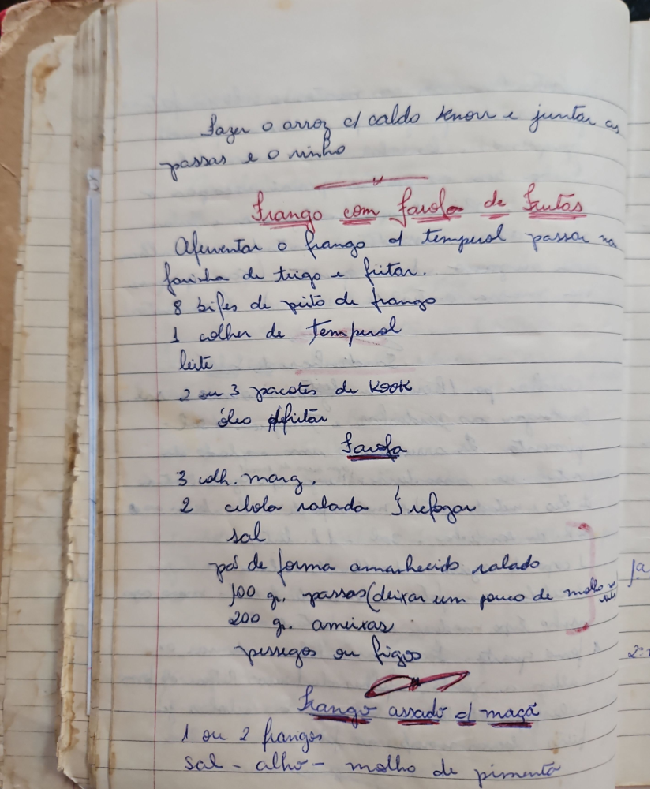

# Página 69
:::danger[NÃO REVISADO]
A página não foi revisada, portanto pode conter erros de digitação, formatação ou alucinações.
:::
Fazer o arroz c/caldo knorr e juntar as
passas e o minho

## Frango com favos de frutas

- Afumentar o frango
- d tempural passar na farinha de trigo e fritar.
- 8 bifes de peito de frango
- 1 colher de temporul
- leite
- 2 ou 3 pacotes de kook
- óleo p/fritar

### Sarva

- 3 collh. marg.
- 2 cibola ralada
- refogar
- sal

- pão de forma amarrhecido salado
- 100 gr. passas (deixar um pouco de molho)
- 200 gr. ameixas
- pessigos ou figos

## Frango assado cl maça

- 1 ou 2 frangos
- sal - alho - molho de pimenta

