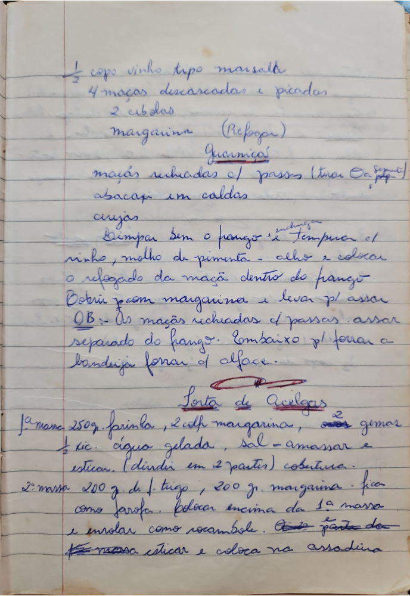

# Página 70
:::danger[NÃO REVISADO]
A página não foi revisada, portanto pode conter erros de digitação, formatação ou alucinações.
:::

## [Sem título - Receita de frango assado]

- 1/2 copo vinho tipo marsalla
- 4 maçãs descascadas e picadas
- 2 cebolas
- margarina (Refogar)

### Guarnições
- maçãs recheadas c/ passas (tirar Os pequenos)
- abacaxi em caldas
- cerejas

### Modo de preparo
- Limpar bem o frango - e tempurar c/ vinho, molho de pimenta - alho e colocar o refogado da maçã dentro do frango.
- Cobrir c/ margarina e levar pl assar.

### OBS
- As maçãs recheadas c/ passas assar separado do frango. Embaixo pl forrar a bandeija forrar c/ alface.

## Torta de Acelga

### 1a massa
- 250g. farinha
- 2 cdlh margarina
- 2 gemas
- 1/2 xic. água gelada
- sal - amassar e esticar. (dividir em 2 partes) cobertura.

### 2a massa
- 200 g de f. trigo
- 200 gr. margarina - fica como farofa.
- colocar encima da 1a massa e enrolar como rocambole.

Esta parte doc massa esticar e coloca na assadeira.

