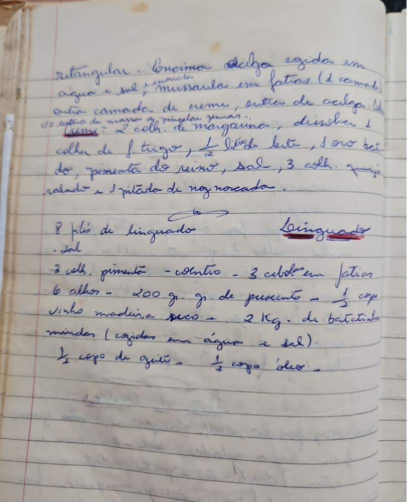

# Página 71
:::danger[NÃO REVISADO]
A página não foi revisada, portanto pode conter erros de digitação, formatação ou alucinações.
:::
retangular. Em cima couve refogada em
água e sal, Mussarela em fatias (1 camada)
outra camada de creme, antes de colocar
do repouso de massa, salpicar gemas...

### Creme:
- 2 colh. de margarina,
- dissolver 1 colher de f. trigo,
- 1/2 litro leite,
- 1 ovo batido,
- pimenta do reino,
- sal,
- 3 colh. queijo ralado
- 1 pitada de noz moscada.

## Linguado

- 8 filés de linguado
- sal
- 3 colh. pimenta - coentro - 3 cebolas em fatias
- 6 alhos - 200 gr. de presunto - 1/2 copo vinho madeira seco - 2 Kg. de batatinhas miúdas (cozidas em água e sal).
- 1/2 copo de azeite - 1/2 copo óleo -

