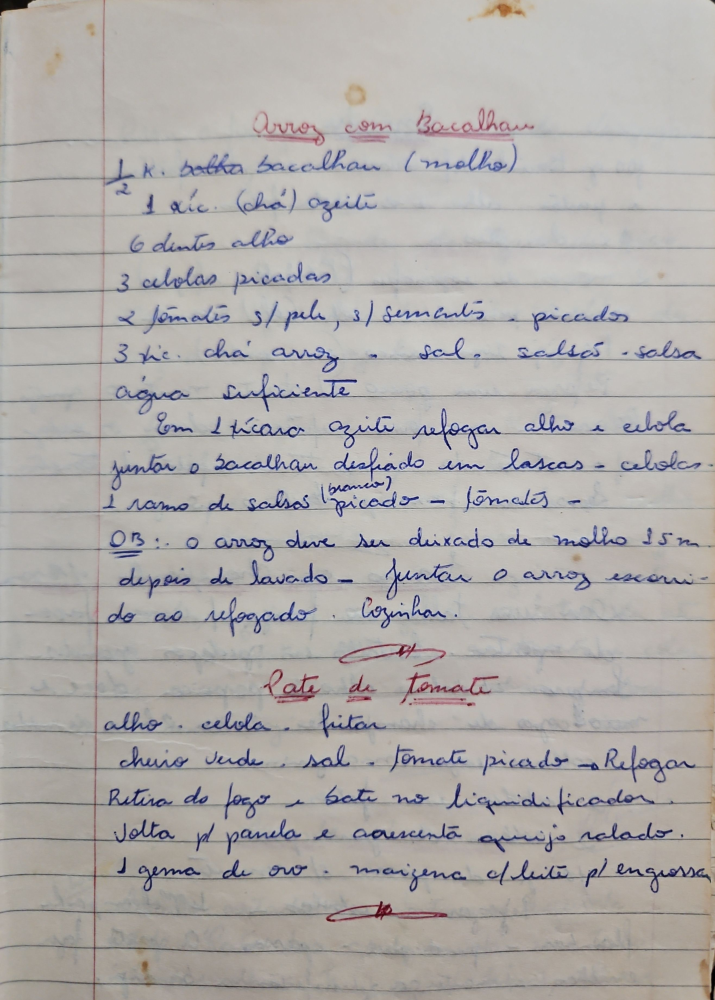

# Página 72
:::danger[NÃO REVISADO]
A página não foi revisada, portanto pode conter erros de digitação, formatação ou alucinações.
:::
## Arroz com Bacalhau

- 1/2 K. bolha bacalhau (molho)
- 1 xic. (chá) azeite
- 6 dentes alho
- 3 cebolas picadas
- 2 tomates s/pele, s/sementes - picados
- 3 xic. chá arroz - sal - salsão - salsa
- água suficiente

- Em 1 xícara azeite refogar alho e cebola
- juntar o bacalhau desfiado em lascas - cebolas -
- 1 ramo de salsa (branco) picado - tomates -

OB.: o arroz deve ser deixado de molho 15m depois de lavado - Juntar o arroz escorrido ao refogado. Cozinhar.

## Pate de Tomate

- alho . cebola . fritar
- cheiro verde . sal . Tomate picado - Refogar
- Retira do fogo e bate no liquidificador.
- Volta p/ panela e acrescenta queijo ralado.
- 1 gema de ovo . maizena c/ leite p/ engrossar

