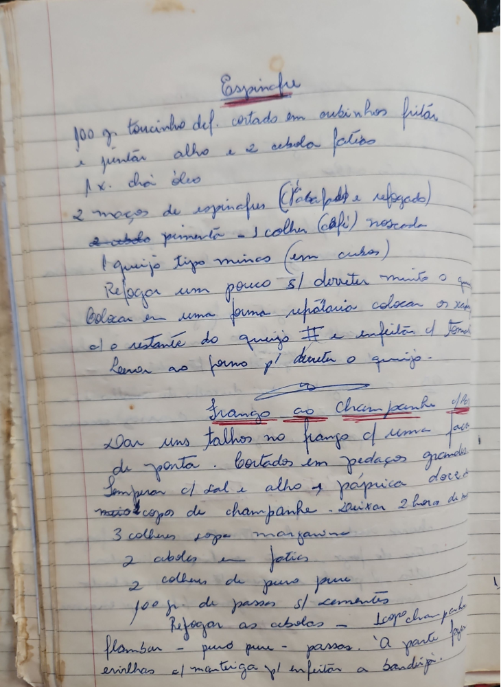

# Página 73
:::danger[NÃO REVISADO]
A página não foi revisada, portanto pode conter erros de digitação, formatação ou alucinações.
:::
## Espinafre

*   100 g. toucinho def. cortado em cubinhos fritos
*   juntar alho e cebola fatias
*   1 X. chá óleo
*   2 maços de espinafre (escaldado e refogado)
*   2 cebola pimenta - 1 colher (café) noscada
*   1 queijo tipo minas (em cubos)

Refogar um pouco s/ derreter muito o queijo. Colocar em uma forma refratária colocar os queijo e o restante do queijo # e enfeitar c/ tomate.
Levar ao forno p' derreter o queijo.

---

## Frango ao Champanhe

*   Dar uns talhos no frango c/ uma faca de ponta
*   cortados em pedaços grandes
*   Temperar c/ sal e alho e páprica doce
*   meio copo de champanhe - deixar 2 hora de molho
*   3 colheres sopa margarina
*   2 cebolas - fatias
*   2 colheres de purê purê
*   100 gr. de passos s/ sementes

Refogar as cebolas - 1 copo champanhe - flambar - purê purê - passos.
À parte fazer ervilhas c/ manteiga p/ enfeitar a bandija.

