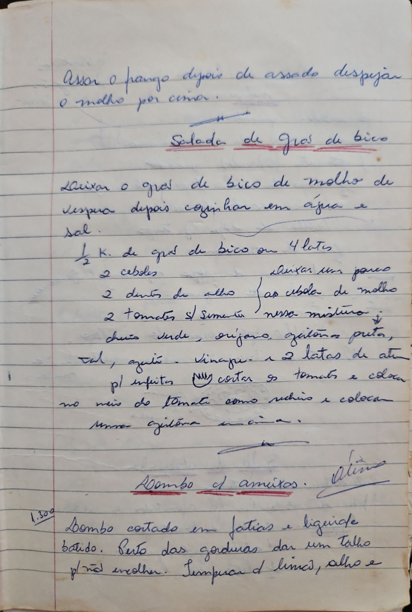

# Página 74
:::danger[NÃO REVISADO]
A página não foi revisada, portanto pode conter erros de digitação, formatação ou alucinações.
:::
Assar o frango depois de assado despejar o molho por cima.

### Salada de Gros de Bico

Deixar o gros de bico de molho de véspera depois cozinhar em água e sal.

* ½ K. de gros de bico ou 4 latas
* 2 cebolas
* 2 dentes de alho
* fazer as cebolas de molho nesse misturo
* 2 tomates s/ semente
* chui verde, orégano, azeitonas pretas, sal, azeite, vinagre
* 2 latas de atum

para enfeitar pode cortar os tomates e colocar no meio do tomate como recheio e colocar uma azeitona em cima.

### Lombo d amêxios

Lombo cortado em fatias e ligeiramente batido. Retirar das gorduras dar um talho p/ não encolher. Temperar de limão, alho e

