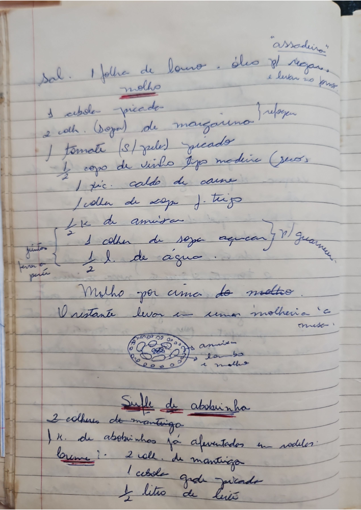

# Página 75
:::danger[NÃO REVISADO]
A página não foi revisada, portanto pode conter erros de digitação, formatação ou alucinações.
:::

Sal. 1 folha de louro. óleo p/ refogar.

"assadeira"
e levar ao forno.

### molho

*   1 cebola picada
*   2 colh. (Sopa) de margarina refogar
*   1 tomate (S/ pele) picado
*   ½ copo de vinho tipo madeira (seco)
*   1 xic. caldo de carne
*   1 colher de sopa f. trigo
*   ½ x de amisan.
*   juntos ferver a parte
    *   1 colher de sopa açucar  p/ guarnecer.
    *   ½ l. de água.

Molho por cima do molho.
O restante levar a uma molheira e a mesa.

## Sufle de abobrinha

*   2 colheres de manteiga
*   1 K. de abobrinhas já aferventados em rodelles.
*   breve?
*   2 coll. de manteiga
*   1 cebola grade picado
*   ½ litro de leite

