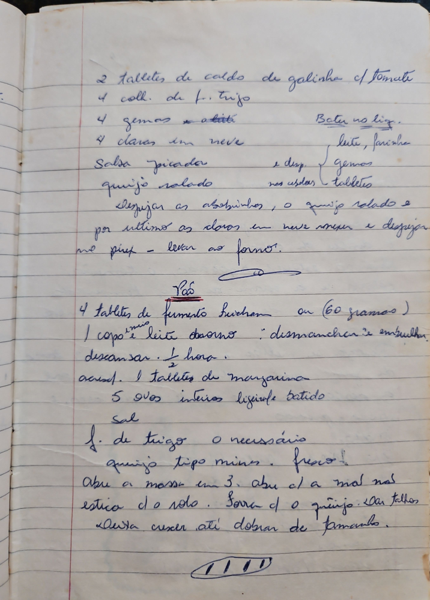

# Página 76
:::danger[NÃO REVISADO]
A página não foi revisada, portanto pode conter erros de digitação, formatação ou alucinações.
:::
- 2 tabletes de caldo de galinha c/ tomate
- 4 coll. de f. trigo
- 4 gemas batidas
- 4 claras em neve
- Salsa picada
- Queijo ralado

Bater no liq.
- leite, farinha
- gemas
- tabletes
e dep. nos outros
Despejar as aboborinhas, o queijo ralado e
por ultimo as claras em neve mexer e despejar
no pirex - levar ao forno.

## Pão

- 4 tabletes de fermento fleischman ou (60 gramos)
- 1 copo e ½ leite morno: desmanchar e embrulhar
- descansar. ½ hora.
- acresc. 1 tablete de margarina
- 5 ovos inteiros ligeirle batido
- sal
- f. de trigo o necessario
- queijo tipo minas. fresco!

Abre a massa em 3. abiu el a mal nal
estica do rolo. Sorra el o queijo em talhas
Deixa creser ati dobrar de tamanho.

