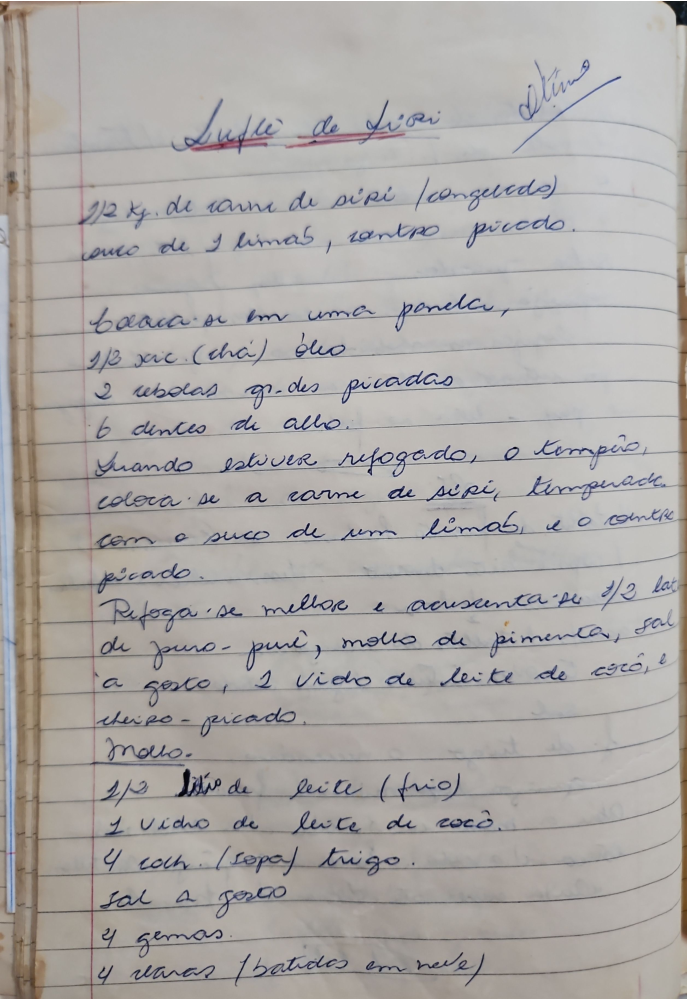

# Página 77
:::danger[NÃO REVISADO]
A página não foi revisada, portanto pode conter erros de digitação, formatação ou alucinações.
:::
## Suflé de Siri
Ilka

*   1/2 Kg de carne de siri (congelado)
*   suco de 1 limão, coentro picado.
*   Loura-se em uma panela,
*   1/3 xíc. (chá) óleo
*   2 cebolas grandes picadas
*   6 dentes de alho.
*   Quando estiver refogado, o tempêro,
*   coloca-se a carne de siri, temperada
*   com o suco de um limão, e o coentro
*   picado.
*   Refoga-se melhor e acrescenta-se 1/2 lata
*   de purê, molho de pimenta, sal
*   a gosto, 1 vidro de leite de coco, e
*   cheiro-verde picado.

### Molho

*   1/2 litro de leite (frio)
*   1 vidro de leite de coco.
*   4 colh. (sopa) trigo.
*   sal a gosto
*   4 gemas.
*   4 claras (batidas em neve)

