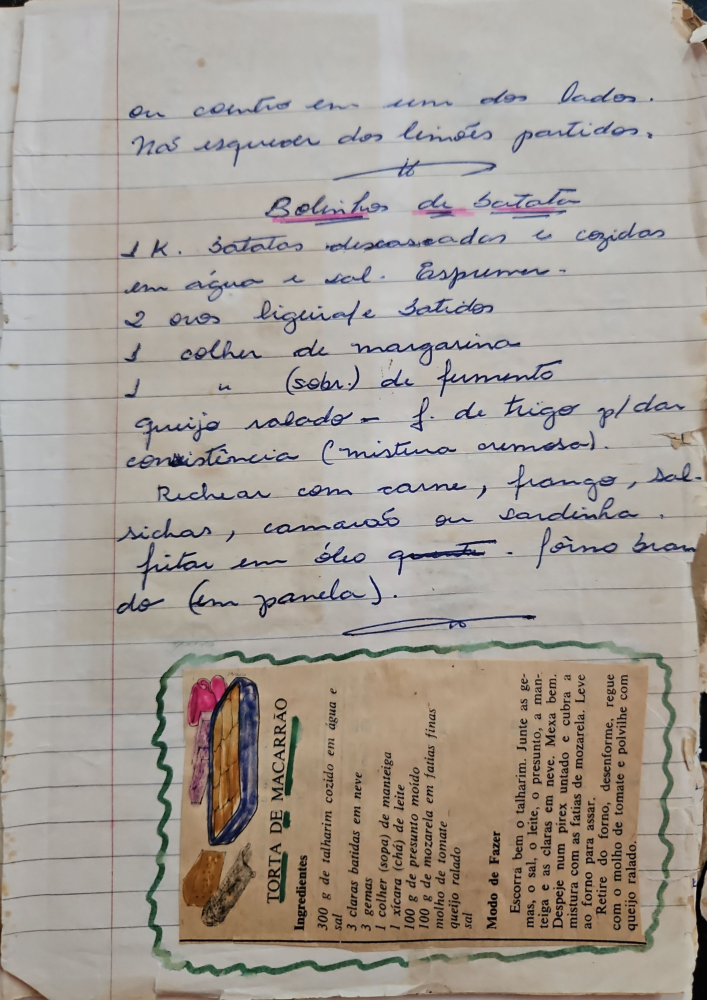

# Página 78
:::danger[NÃO REVISADO]
A página não foi revisada, portanto pode conter erros de digitação, formatação ou alucinações.
:::
ou centro em um dos lados.
Não esquecer dos limites partidos.

## Bolinhos de Batata

- 1 K. Batatas descascadas e cozidas em água e sal. Espremas.
- 2 ovos liquidale batidos
- 1 colher de margarina
- 1 " (sobr.) de fermento
- queijo ralado - f. de trigo pl/dar consistência (mistura cremosa).

Rechear com carne, frango, salsichas, camarão ou sardinha.
Fritar em óleo quente - forno brando (em panela).

## TORTA DE MACARRÃO

### Ingredientes

- 300 g de talharim cozido em água e sal
- 3 claras batidas em neve
- 3 gemas
- 1 colher (sopa) de manteiga
- 1 xícara (chá) de leite
- 100 g de presunto moído
- 100 g de mozzarella em fatias finas
- molho de tomate
- sal
- queijo ralado

### Modo de Fazer

- Escorra bem o talharim. Junte as gemas, o sal, o leite, o presunto, a manteiga e as claras em neve. Mexa bem.
- Despeje num pirex untado e cubra a mistura com as fatias de mozarela. Leve ao forno para assar.
- Retire do forno, desenforme, regue com o molho de tomate e polvilhe com queijo ralado.

