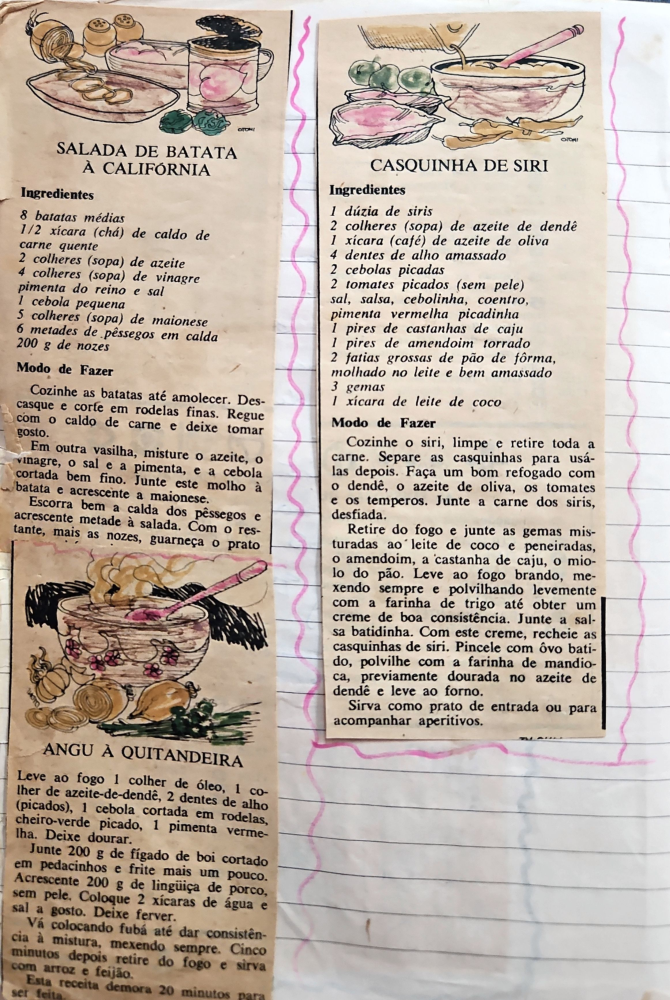

# Página 79
:::danger[NÃO REVISADO]
A página não foi revisada, portanto pode conter erros de digitação, formatação ou alucinações.
:::
## SALADA DE BATATA À CALIFÓRNIA

### Ingredientes

-   8 batatas médias
-   1/2 xícara (chá) de caldo de carne quente
-   2 colheres (sopa) de azeite
-   4 colheres (sopa) de vinagre
-   pimenta do reino e sal
-   1 cebola pequena
-   5 colheres (sopa) de maionese
-   6 metades de pêssegos em calda
-   200 g de nozes

### Modo de Fazer

Cozinhe as batatas até amolecer. Descasque e corte em rodelas finas. Regue com o caldo de carne e deixe tomar gosto.

Em outra vasilha, misture o azeite, o vinagre, o sal e a pimenta, e a cebola cortada bem fino. Junte este molho à batata e acrescente a maionese.

Escorra bem a calda dos pêssegos e acrescente metade à salada. Com o restante, mais as nozes, guarneça o prato.

## CASQUINHA DE SIRI

### Ingredientes

-   1 dúzia de siris
-   2 colheres (sopa) de azeite de dendê
-   1 xícara (café) de azeite de oliva
-   4 dentes de alho amassado
-   2 cebolas picadas
-   2 tomates picados (sem pele)
-   sal, salsa, cebolinha, coentro, pimenta vermelha picadinha
-   1 pires de castanhas de caju
-   1 pires de amendoim torrado
-   2 fatias grossas de pão de fôrma, molhado no leite e bem amassado
-   3 gemas
-   1 xícara de leite de coco

### Modo de Fazer

Cozinhe o siri, limpe e retire toda a carne. Separe as casquinhas para usá-las depois. Faça um bom refogado com o dendê, o azeite de oliva, os tomates e os temperos. Junte a carne dos siris, desfiada.

Retire do fogo e junte as gemas misturadas ao leite de coco e peneiradas, o amendoim, a castanha de caju e o miolo do pão. Leve ao fogo brando, mexendo sempre e polvilhando levemente com a farinha de trigo até obter um creme de boa consistência. Junte a salsa batidinha. Com este creme, recheie as casquinhas de siri. Pincele com ôvo batido, polvilhe com a farinha de mandioca, previamente dourada no azeite de dendê e leve ao forno.

Sirva como prato de entrada ou para acompanhar aperitivos.

## ANGU À QUITANDEIRA

Leve ao fogo 1 colher de óleo, 1 colher de azeite-de-dendê, 2 dentes de alho (picados), 1 cebola cortada em rodelas, cheiro-verde picado, 1 pimenta vermelha. Deixe dourar.

Junte 200 g de fígado de boi cortado em pedacinhos e frite mais um pouco. Acrescente 200 g de linguiça de porco, sem pele. Coloque 2 xícaras de água e sal a gosto. Deixe ferver.

Vá colocando fubá até dar consistência à mistura, mexendo sempre. Cinco minutos depois retire do fogo e sirva com arroz e feijão.

Esta receita demora 20 minutos para ser feita.

