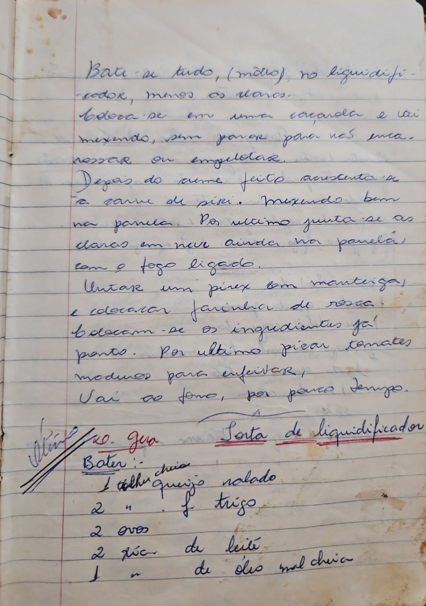

# Página 80
:::danger[NÃO REVISADO]
A página não foi revisada, portanto pode conter erros de digitação, formatação ou alucinações.
:::
## Sopa de liquidificador

Bate-se tudo, (môlho), no liquidificador, menos os ovos.
Coloca-se em uma caçarola e vai mexendo, sem parar para não empelotar ou engelodar.
Depois do creme feito acrescenta-se a carne de siri. Mexendo bem na panela. Por ultimo junta-se as claras em neve ainda na panela com o fogo ligado.
Untar um pirex com manteiga, e colocar farinha de rosca.
Colocam-se os ingredientes já prontos. Por ultimo picar tomates médios para enfeitar.
Vai ao forno, por pouco tempo.

### Bater:-
-   1 colh cheia queijo ralado
-   2 " f trigo
-   2 ovos
-   2 xc de leite
-   1 " de oleo mal cheia

