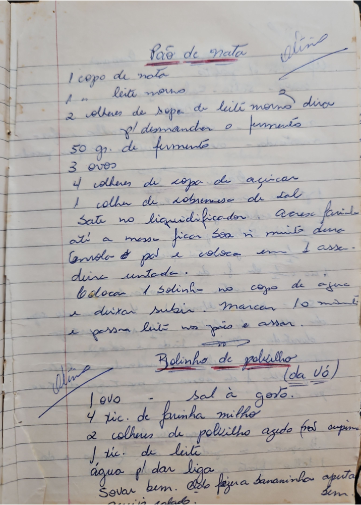

# Página 82
:::danger[NÃO REVISADO]
A página não foi revisada, portanto pode conter erros de digitação, formatação ou alucinações.
:::
## Pão de Nata
Otino
- 1 copo de nata
- 1 leite morno
- 2 colheres de sopa de leite morno diluir
- p/ desmancher o fermento
- 50 gr. de fermento
- 3 ovos
- 4 colheres de sopa de açucar
- 1 colher de sobremesa de sal
- Bate no liquidificador
- Acrescente farinha
- até a massa ficar boa n muito dura
- Enrola o pão e coloca em 1 assa-
- deira untada.
- Colocar 1 bolinho no copo de agua
- e deixar subir. Marcar 10 min.
- e passar leite nos pães e assar.

## Bolinho de polvilho
Otino (da Vó)
- 1 ovo
- sal à gosto.
- 4 xic. de farinha milho
- 2 colheres de polvilho azedo pra soprar
- 1 xic. de leite
- água p/ dar liga
- Sovar bem. da pra fazer a bananinha apertando sim.

