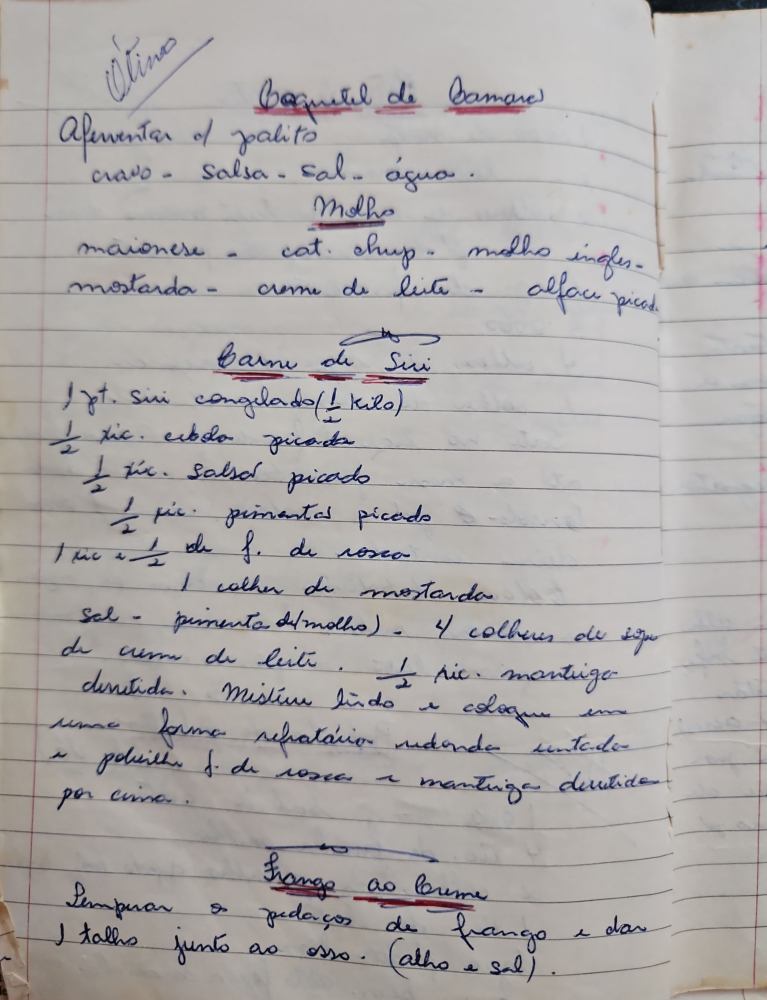

# Página 83
:::danger[NÃO REVISADO]
A página não foi revisada, portanto pode conter erros de digitação, formatação ou alucinações.
:::
## Baquetel de Camarão

Aferventar o palito
- cravo
- salsa
- sal
- água

### Molho
- maionese
- cat. chup.
- molho ingles
- mostarda
- creme de leite
- alface picada

### Carne de Siri
- 1 pt. siri congelado (½ kilo)
- ½ xic. cebola picada
- ½ xic. salsão picado
- ½ xic. pimentas picados
- 1 xic e ½ de f. de rosca
- 1 colher de mostarda
- sal
- pimenta (molho)
- 4 colheres de sopa de creme de leite
- ½ xic. mantiga derretida.
Misture tudo e coloque em
uma forma refratária redonda untada
e polvilhe f. de rosca e manteiga derretida
por cima.

## Frango ao Brume

Temperar os pedaços de frango e dar
os talhos junto ao osso. (alho e sal).

