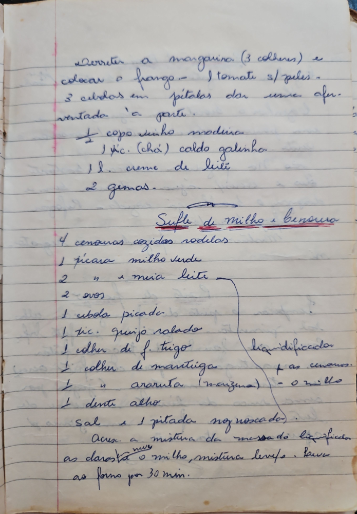

# Página 84
:::danger[NÃO REVISADO]
A página não foi revisada, portanto pode conter erros de digitação, formatação ou alucinações.
:::
Derreter a margarina (3 colheres) e
colocar o frango. 1 tomate s/ peles.
3 cebolas em pétalas dar uma afer-
ventada 'a parte.

- 1/2 copo vinho madeira
- 1 xc. (chá) caldo galinha
- 1 l. creme de leite
- 2 gemas.

## Sufle de Milho e Cenoura

- 4 cenouras cozidas rodelas
- 1 xícara milho verde
- 2 " e meia leite
- 2 ovos
- 1 cebola picada
- 1 xic. queijo ralado
- 1 colher de f. trigo
- 1 colher de martiga
- 1 " araruta (maisena)
- 1 dente alho
- Sal e 1 pitada noz moscada

líquidificador
p/ as cenoras
- o milho

Acresc. a mistura da messa do liquidificador
as clarás e o milho, mistura leve. Leve
ao forno por 30 min.

