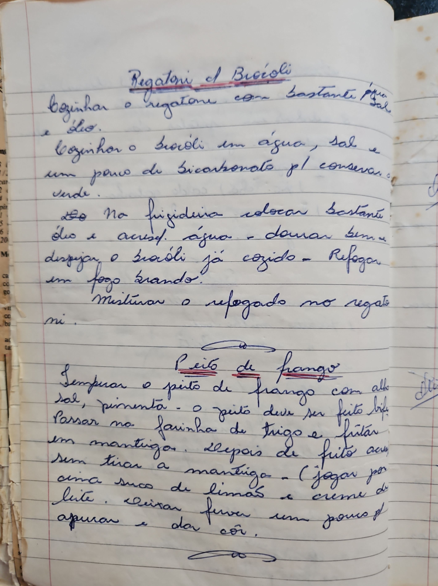

# Página 85
:::danger[NÃO REVISADO]
A página não foi revisada, portanto pode conter erros de digitação, formatação ou alucinações.
:::
## Rigatoni e Brócolis

- Cozinhar o rigatone com bastante água e óleo.
- Cozinhar o brócoli em água, sal e um pouco de bicarbonato p/ conservar verde.
- Na frigideira colocar bastante óleo e acresc. água - dourar bem e despejar o brócoli já cozido - Refogar em fogo brando.
- Misturar o refogado no regatoni.

## Peito de frango

- Semperar o peito de frango com alho, sal, pimenta - o peito deve ser feito bife.
- Passar na farinha de trigo e fritar em manteiga.
- Depois de frito acum. a manteiga - (jogar por cima suco de limão e creme de leite. Deixar ferver um pouco pl apurar e dar côr.

