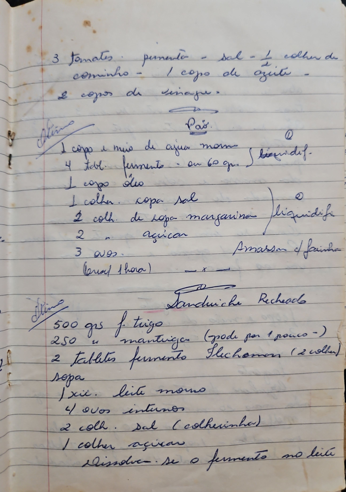

# Página 86
:::danger[NÃO REVISADO]
A página não foi revisada, portanto pode conter erros de digitação, formatação ou alucinações.
:::
3 tomates pimenta - sal - ½ colher de cominho
1 copo de azeite -
2 copos de vinagre -

## Pão

*   1 copo e meio de agua morna
*   4 tabl. fermento - ou 60 gr. } liquidif-
*   1 copo oleo
*   1 colher sopa sal
*   2 coll de sopa margarina } liquidifi
*   2 açucar
*   3 ovos.
(fermenta 1 hora)
Amassar c/farinha

## Sanduiche Recheado

*   500 grs f. trigo
*   250 " mantiega (pode por 1 pouco -)
*   2 tablets fermento Flechomans (2 colhe) sopa
*   1 xc. leite morno
*   4 ovos inteiros
*   2 coll. sal (colhecinha)
*   1 colher açucar
Dissolue-se o fermento no leite

