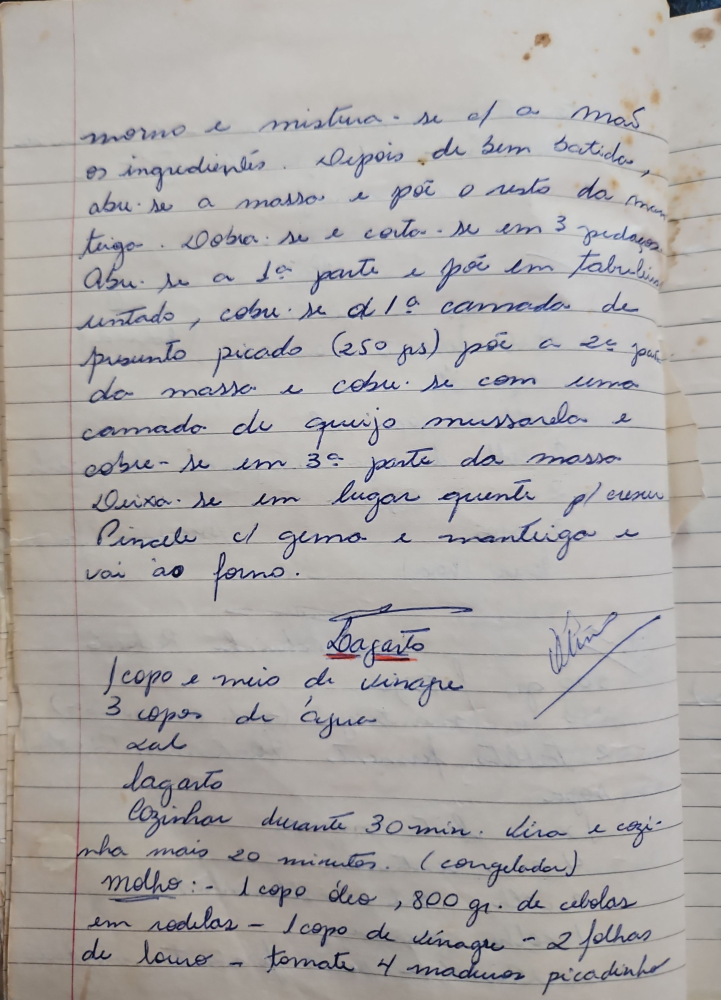

# Página 87
:::danger[NÃO REVISADO]
A página não foi revisada, portanto pode conter erros de digitação, formatação ou alucinações.
:::
... morno e mistura-se c/ a mão
os ingredientes. Depois de bem batidos,
abru-se a massa e põe o resto da man-
teiga. Dobra-se e corta-se em 3 pedaços.
Abru-se a 1ª parte e põe em tabuleiro
untado, cobre-se c/ a 1ª camada de
presunto picado (250 grs), põe a 2ª parte
da massa e cobre-se com uma
camada de queijo mussarela e
cobre-se com a 3ª parte da massa.
Deixa-se em lugar quente p/ crescer.
Pincele c/ gema e manteiga e
vai ao forno.

## Lagarto

- 1 copo e meio de vinagre
- 3 copos de água
- Sal

Lagarto
Cozinhar durante 30 min. Vira e cozi-
nha mais 20 minutos. (congelado)

### Molho:

- 1 copo óleo
- 800 gr. de cebolas em rodelas
- 1 copo de vinagre
- 2 folhas de louro
- tomate 4 maduros picadinho

