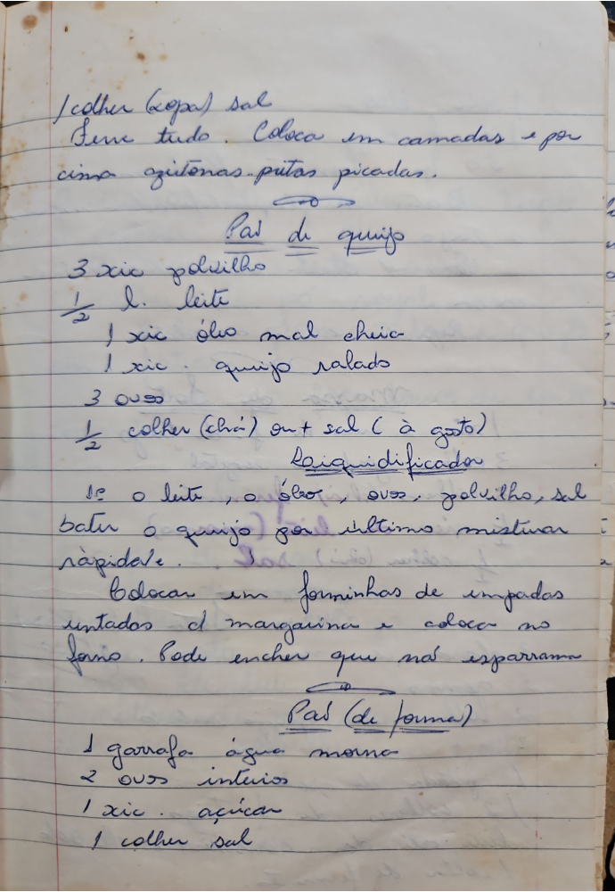

# Página 88
:::danger[NÃO REVISADO]
A página não foi revisada, portanto pode conter erros de digitação, formatação ou alucinações.
:::
colher (sopa) sal
Serve tudo. Coloca em camadas e por
cima azeitonas pretas picadas.

## Pão de queijo

- 3 xic polvilho
- ½ l. leite
- 1 xic óleo mal cheia
- 1 xic. queijo ralado
- 3 ovos
- ½ colher (chá) ou + sal (à gosto)

### No liquidificador

- Bate o leite, o óleo, ovos, polvilho, sal
- Bater o queijo por último misturar
rapidamente.
- Colocar em forminhas de empadas
untadas c[om] margarina e colocar no
forno. Pode encher que não esparrama

## Pão (de forma)

- 1 garrafa água morna
- 2 ovos inteiros
- 1 xic. açúcar
- 1 colher sal

