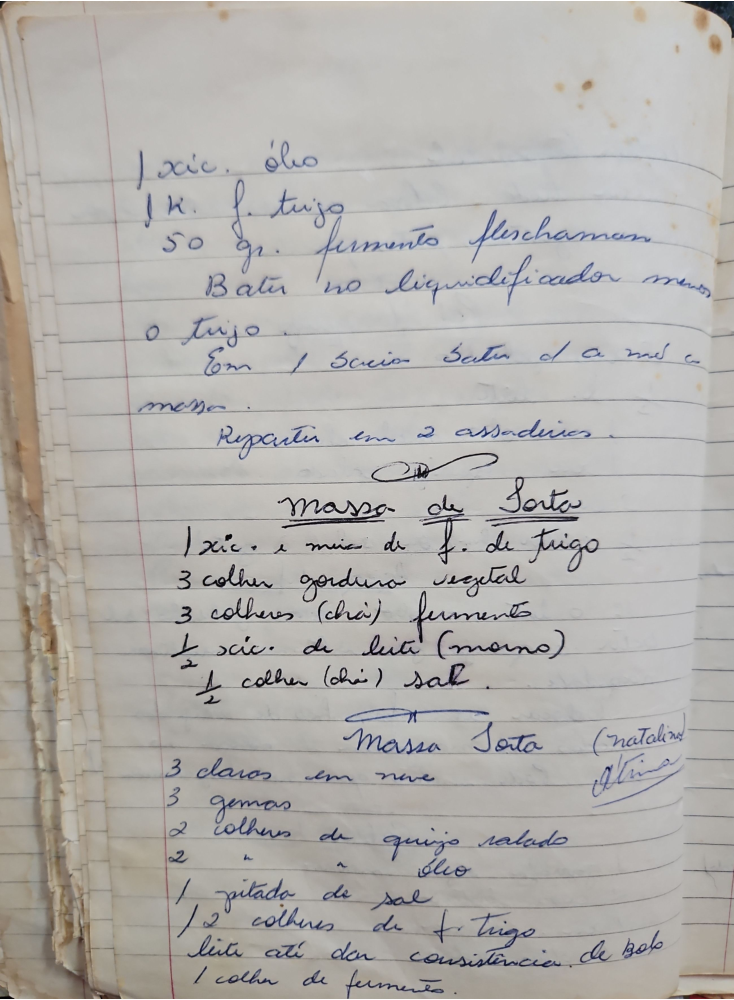

# Página 89
:::danger[NÃO REVISADO]
A página não foi revisada, portanto pode conter erros de digitação, formatação ou alucinações.
:::
1 xic. óleo
1 K. f. trigo
50 gr. fermento fleschman
Bater no liquidificador menos
o trigo.
Em 1 bacia Bater de a mis e a
massa.
Repartir em 2 assadeiras.

## Massa de Sorte
* 1 xic. e meia de f. de trigo
* 3 colher gordura vegetal
* 3 colheres (chá) fermento
* 1/2 xic. de leite (morno)
* 1/2 colher (chá) sal.

## Massa Sorte (natalina) Atina
* 3 claros em neve
* 3 gemas
* 2 colheres de queijo ralado
* 2 " " óleo
* 1 pitada de sal
* 1/2 colheres de f. trigo
* leite até dar consistencia de bolo
* 1 colher de fermento.

