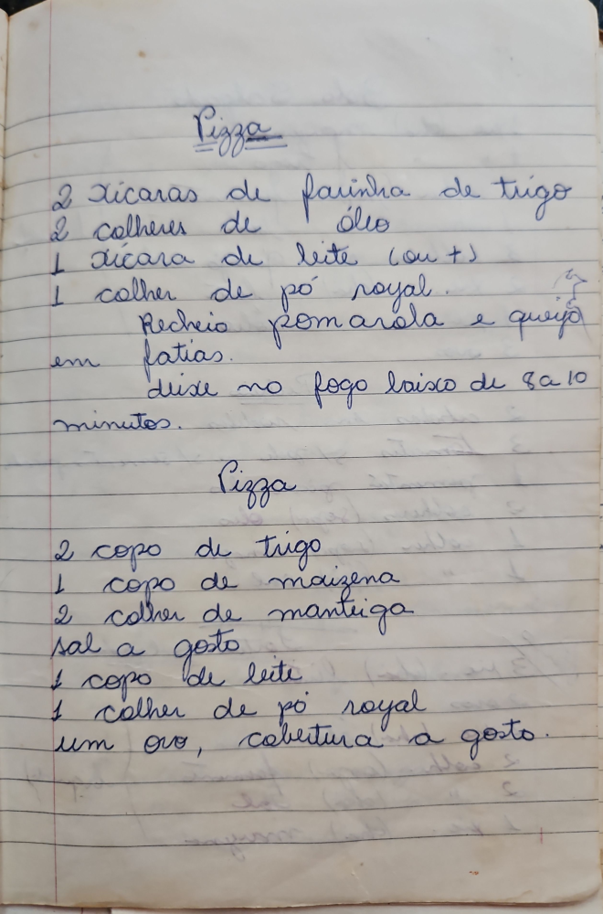

# Página 90
:::danger[NÃO REVISADO]
A página não foi revisada, portanto pode conter erros de digitação, formatação ou alucinações.
:::
## Pizza
- 2 xicaras de farinha de trigo
- 2 colheres de oleo
- 1 xicara de leite (ou +)
- 1 colher de pó royal
Recheio pomarola e queijo em fatias.
deixe no fogo baixo de 8 a 10 minutos.

## Pizza
- 2 copo de trigo
- 1 copo de maizena
- 2 colher de manteiga
- sal a gosto
- 1 copo de leite
- 1 colher de pó royal
um ovo, cobertura a gosto.

