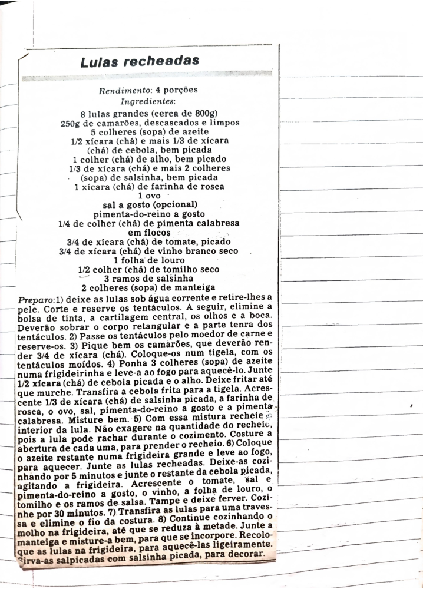

# Página 100
:::danger[NÃO REVISADO]
A página não foi revisada, portanto pode conter erros de digitação, formatação ou alucinações.
:::
## Lulas recheadas

### Rendimento: 4 porções

### Ingredientes:

- 8 lulas grandes (cerca de 800g)
- 250g de camarões, descascados e limpos
- 5 colheres (sopa) de azeite
- 1/2 xícara (chá) e mais 1/3 de xícara (chá) de cebola, bem picada
- 1 colher (chá) de alho, bem picado
- 1/3 de xícara (chá) e mais 2 colheres (sopa) de salsinha, bem picada
- 1 xícara (chá) de farinha de rosca
- 1 ovo
- sal a gosto (opcional)
- pimenta-do-reino a gosto
- 1/4 de colher (chá) de pimenta calabresa em flocos
- 3/4 de xícara (chá) de tomate, picado
- 3/4 de xícara (chá) de vinho branco seco
- 1 folha de louro
- 1/2 colher (chá) de tomilho seco
- 3 ramos de salsinha
- 2 colheres (sopa) de manteiga

### Preparo:

1. Deixe as lulas sob água corrente e retire-lhes a pele, corte e reserve os tentáculos. A seguir, elimine a bolsa de tinta, a cartilagem central, os olhos e a boca. Deverão sobrar o corpo retangular e a parte tenra dos tentáculos.
2. Passe os tentáculos pelo moedor de carne e reserve-os.
3. Pique bem os camarões, que deverão render 3/4 de xícara (chá). Coloque-os num tigela, com os tentáculos moídos.
4. Ponha 3 colheres (sopa) de azeite numa frigideira e leve-a ao fogo para aquecê-lo. Junte 1/2 xícara (chá) de cebola picada e o alho. Deixe fritar até que murche. Transfira a cebola frita para a tigela. Acrescente 1/3 de xícara (chá) de salsinha picada, a farinha de rosca, o ovo, sal, pimenta-do-reino a gosto e a pimenta calabresa. Misture bem.
5. Com essa mistura recheie o interior da lula. Não exagere na quantidade do recheio, pois a lula pode rachar durante o cozimento. Costure a abertura de cada uma, para prender o recheio.
6. Coloque o azeite restante numa frigideira grande e leve ao fogo, para aquecer. Junte as lulas recheadas. Deixe-as cozinhando por 5 minutos e junte o restante da cebola picada, agitando a frigideira. Acrescente o tomate, sal e pimenta-do-reino a gosto, o vinho, a folha de louro, o tomilho e os ramos de salsa. Tampe e deixe ferver. Cozinhe por 30 minutos.
7. Transfira as lulas para uma travessa e elimine o fio da costura.
8. Continue cozinhando o molho na frigideira, até que se reduza à metade. Junte a manteiga e misture-a bem, para que se incorpore. Recoloque as lulas na frigideira, para aquecê-las ligeiramente. Sirva-as salpicadas com salsinha picada, para decorar.

