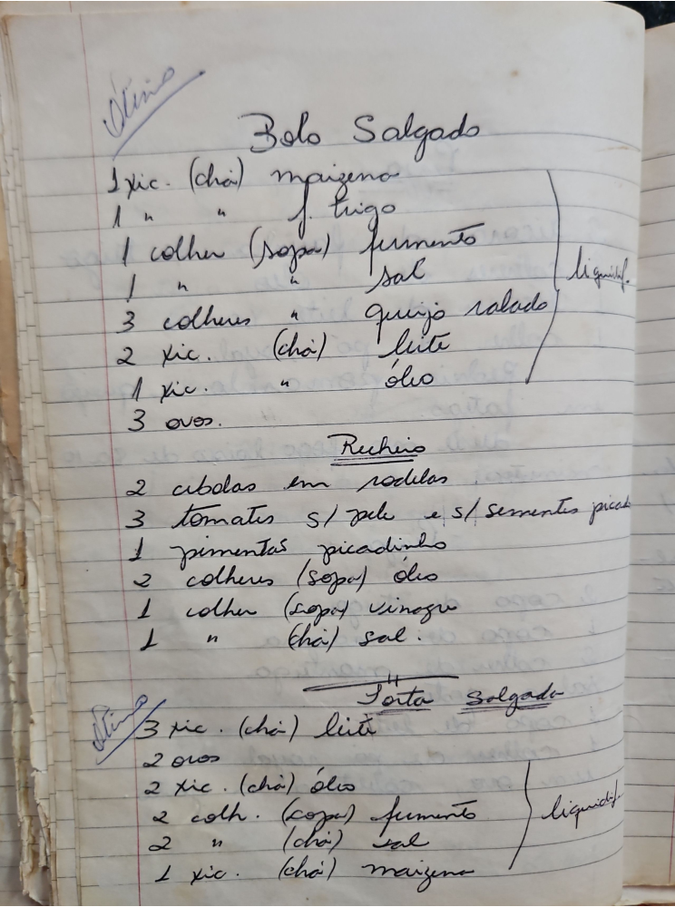

# Página 91
:::danger[NÃO REVISADO]
A página não foi revisada, portanto pode conter erros de digitação, formatação ou alucinações.
:::
## Bolo Salgado

*   1 xíc. (chá) maizena
*   1 " " f. trigo
*   1 colher (sopa) fermento
*   1 " " sal
*   3 colheres " queijo ralado
*   2 xíc. (chá) leite
*   1 xíc. " óleo
*   3 ovos.

`liquidif`

### Recheio

*   2 cebolas em rodelas
*   3 tomates s/ pele e s/ sementes picad
*   1 pimentas picadinho
*   2 colheres (sopa) óleo
*   1 colher (sopa) vinagre
*   1 " (chá) sal.

## Torta Salgada

*   3 xíc. (chá) leite
*   2 ovos
*   2 xíc. (chá) óleo
*   2 colh. (sopa) fermento
*   2 " (chá) sal
*   1 xíc. (chá) maizena

`liquidif`

