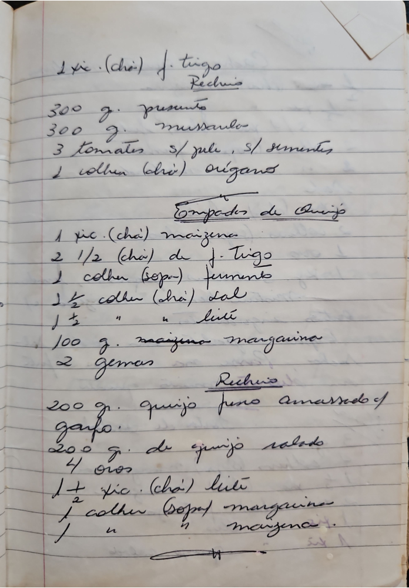

# Página 92
:::danger[NÃO REVISADO]
A página não foi revisada, portanto pode conter erros de digitação, formatação ou alucinações.
:::
### Ingredientes (Possivelmente para uma massa ou outra receita)
- 1 xíc. (chá) f. trigo

### Recheio
- 300 g. presunto
- 300 g. mussarela
- 3 tomates s/ pele, s/ sementes
- 1 colher (chá) orégano

## Empadão de Queijo
- 1 xíc. (chá) maizena
- 2 1/2 (chá) de f. trigo
- 1 colher (sopa) fermento
- 1 1/2 colher (chá) sal
- 1 1/2 " " leite
- 100 g. maizena margarina
- 2 gemas

### Recheio
- 200 g. queijo fresco amassado c/ garfo.
- 200 g. de queijo ralado
- 4 ovos
- 1 1/2 xíc. (chá) leite
- 1 colher (sopa) margarina
- 1 " " maizena.

