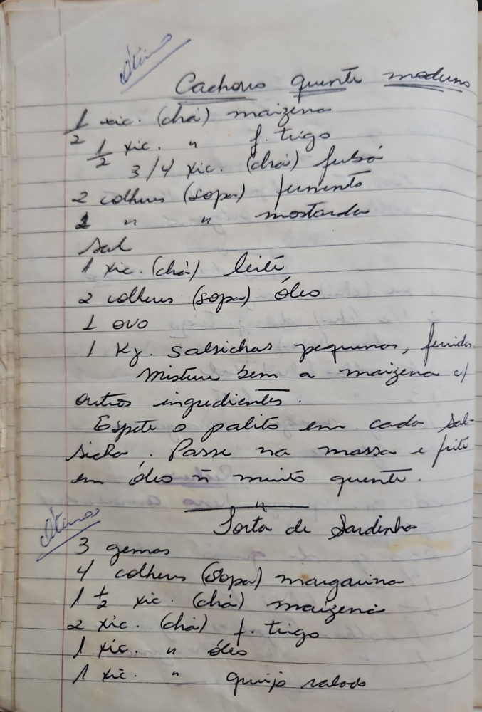

# Página 93
:::danger[NÃO REVISADO]
A página não foi revisada, portanto pode conter erros de digitação, formatação ou alucinações.
:::
## Cachorros quente maduro

- 1 xíc. (chá) maizena
- ½ xíc. f. trigo
- ¾ xíc. (chá) fubá
- 2 colhers (sopa) fermento
- 1 " " mostarda
- Sal
- 1 xíc. (chá) leite
- 2 colhers (sopa) óleo
- 1 ovo
- 1 Kg. salsichas pequenos, feridas

Mistura bem a maizena cf

### Outros ingredientes

- Espete o palito em cada salsicha.
- Passe na massa e frite em óleo muito quente.

---

## Torta de Sardinha

- 3 gemas
- 4 colhers (sopa) margarina
- 1 ½ xíc. (chá) maizena
- 2 xíc. (chá) f. trigo
- 1 xíc. " óleo
- 1 xíc. " queijo ralado

