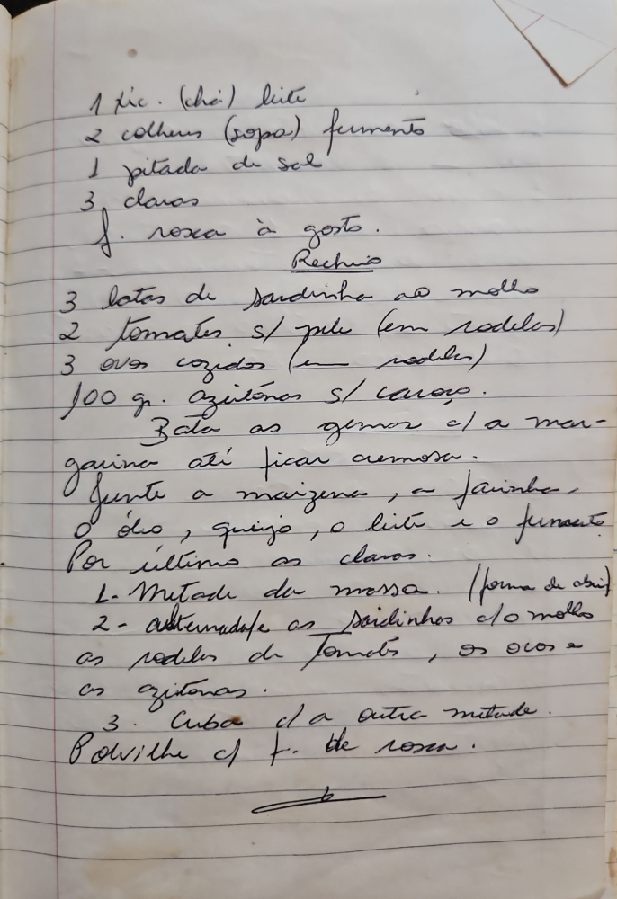

# Página 94
:::danger[NÃO REVISADO]
A página não foi revisada, portanto pode conter erros de digitação, formatação ou alucinações.
:::
## Massa

- 1 xic. (chá) leite
- 2 colheres (sopa) fermento
- 1 pitada de sal
- 3 claras
- f. rosca à gosto.

## Recheio

- 3 latas de sardinha ao molho
- 2 tomates s/ pele (em rodelas)
- 3 ovos cozidos (em rodelas)
- 100 gr. azeitonas s/ caroço.

### Modo de Preparo da Massa

Bata as gemas c/ a margarina até ficar cremosa.
Junte a maizena, a farinha, o óleo, queijo, o leite e o fermento.
Por último as claras.

### Montagem

1. Metade da massa. (forma de abrir)
2. Arrume as sardinhas c/ o molho, as rodelas de tomates, os ovos e as azeitonas.
3. Cubra c/ a outra metade.
Polvilhe c/ a farinha de rosca.

