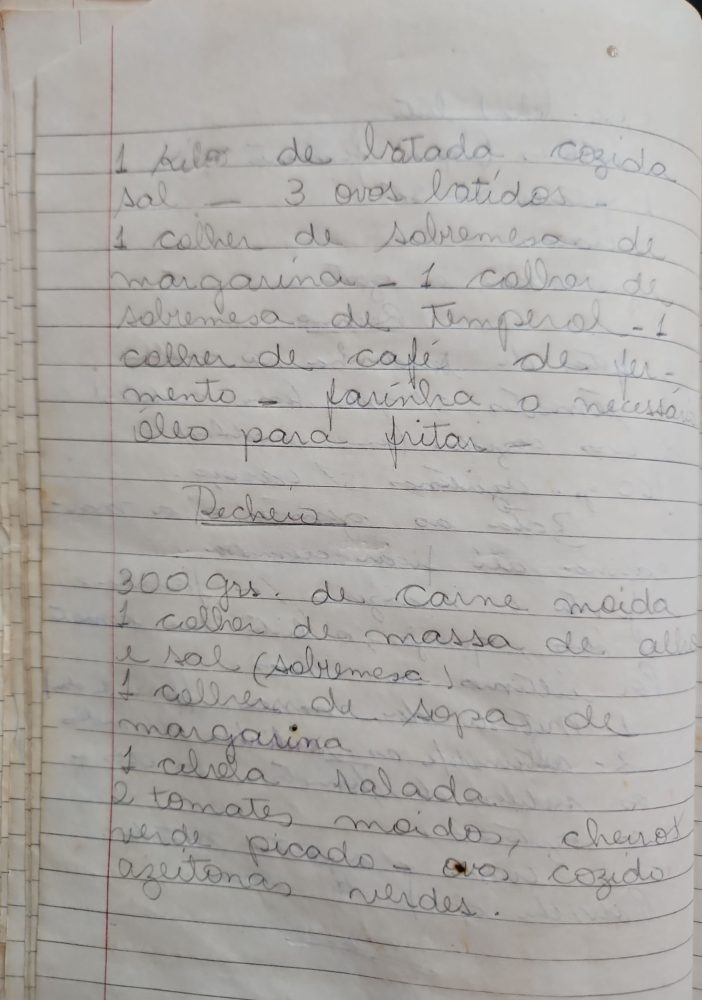

# Página 95
:::danger[NÃO REVISADO]
A página não foi revisada, portanto pode conter erros de digitação, formatação ou alucinações.
:::
## Massa

- 1 kg. de batata cozida
- Sal
- 3 ovos batidos
- 1 colher de sobremesa de margarina
- 1 colher de sobremesa de Temperol
- 1 colher de café de fermento
- Farinha o necessária
- Óleo para fritar

## Recheio

- 300 grs. de Carne moída
- 1 colher de massa de alho e sal (Sobremesa)
- 1 colher de sopa de margarina
- 1 cebola ralada
- 2 tomates moídos
- Pimentão verde picado
- ovos cozidos
- azeitonas verdes.

