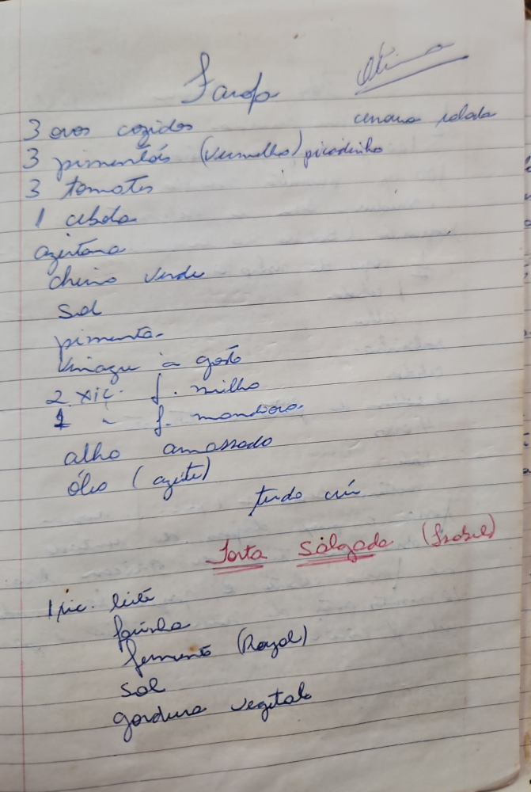

# Página 96
:::danger[NÃO REVISADO]
A página não foi revisada, portanto pode conter erros de digitação, formatação ou alucinações.
:::
## Sardop

- 3 ovos cozidos
- 3 pimentões (vermelho) picadinho
- 3 tomates
- 1 cebola
- cenoura ralada
- azeitona
- cheiro verde
- Sal
- Pimenta
- Vinagre a gosto
- 2 xíc. f. milho
- 1 xíc. f. mandioca
- alho amassado
- óleo (azeite)
- tudo cru

### Torta Salgada (Fria)

- 1 xíc. leite
- Farinha
- Fermento (Royal)
- Sal
- gordura vegetal

