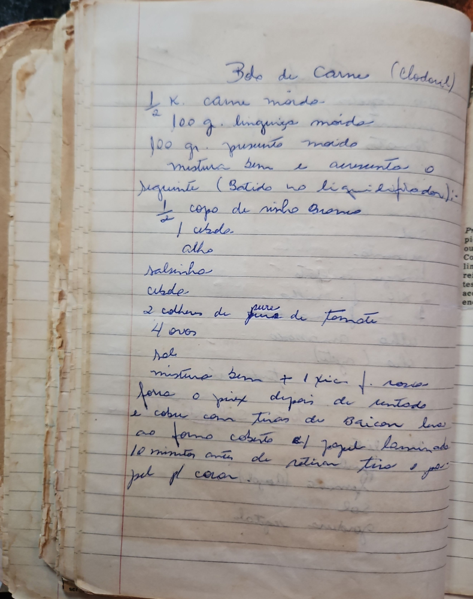

# Página 97
:::danger[NÃO REVISADO]
A página não foi revisada, portanto pode conter erros de digitação, formatação ou alucinações.
:::
## Bôlo de Carne (Clodoul)

### Ingredientes

*   1/2 K. carne moida
*   100 g. linguiça moida
*   100 gr. presunto moida
*   1/2 copo de vinho branco
*   1 cbde.
*   Alho
*   salsinha
*   cbde.
*   2 colhers de pure de tomate
*   4 ovos
*   sal
*   1 xic. f. rosca

### Modo de Preparo

1.  Mistura bem
2.  E aumenta o seguinte (Batido no liquidificador): [ingredientes da lista acima, a partir do vinho branco]
3.  Mistura bem + 1 xic. f. rosca
4.  Fôrma o pão depois de untado
5.  E cobre com tiras de Bacon
6.  Leva ao forno coberto c/ papel laminado
7.  10 minutos antes de retirar tira o papel p/ corar.

